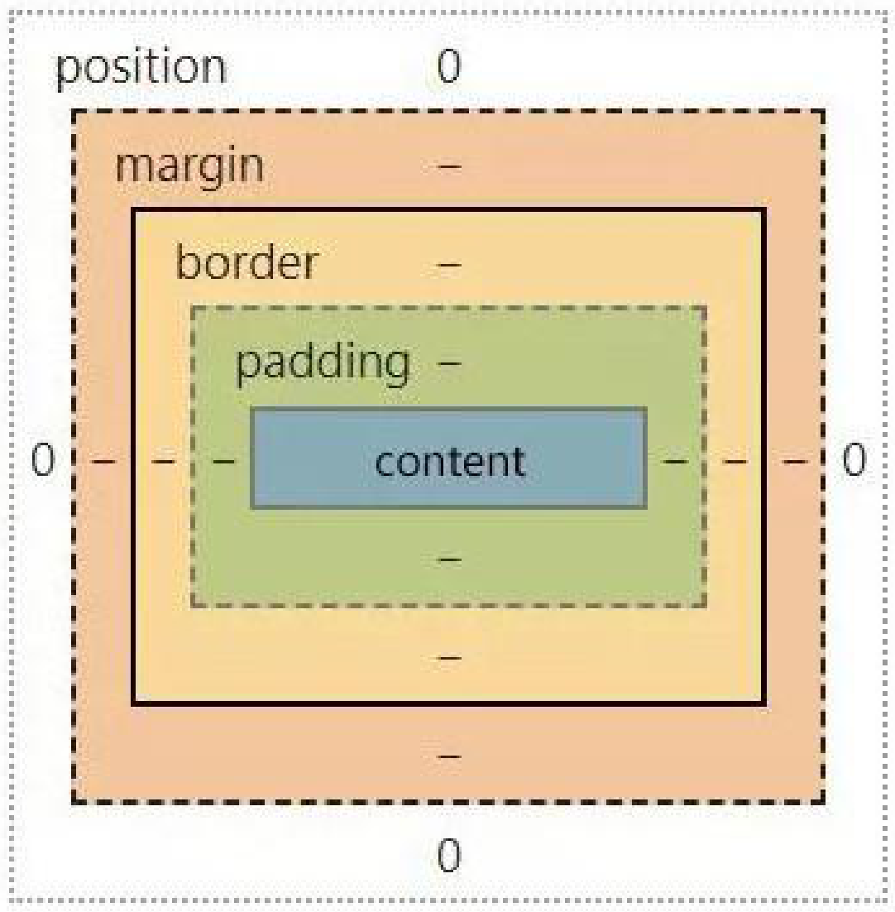
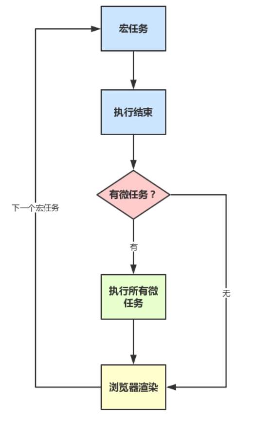
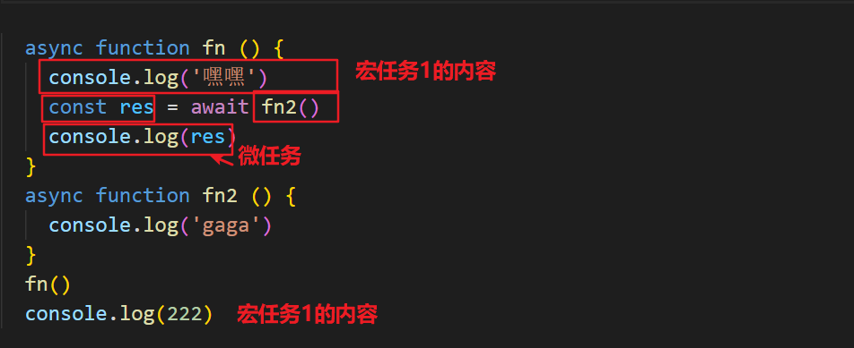
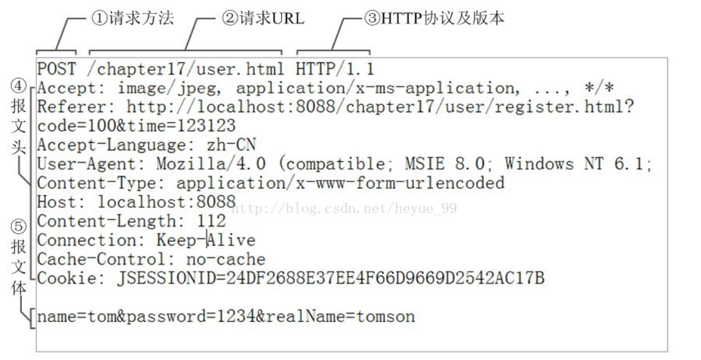
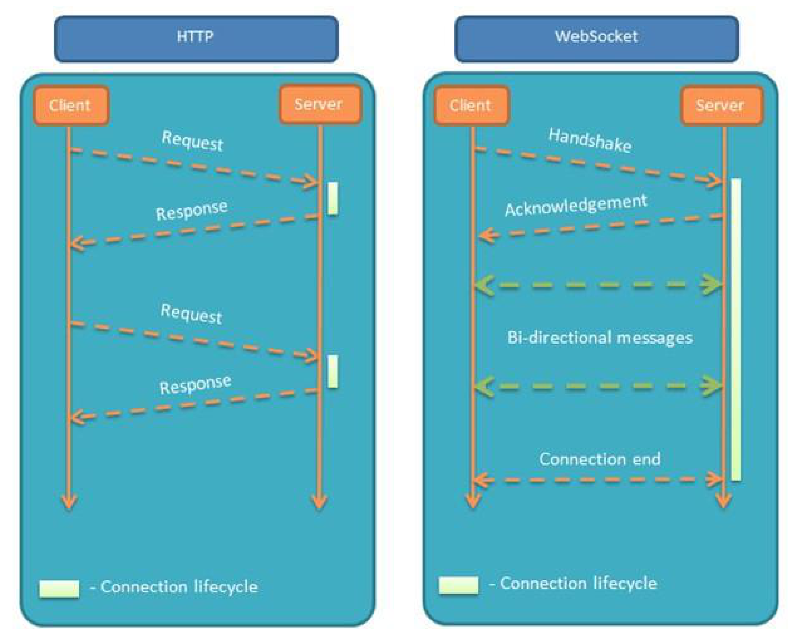
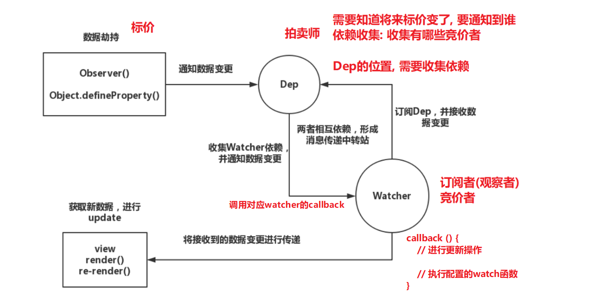

# HTML基础

## 1. HTML 文件中的 DOCTYPE 是什么作用？

HTML超文本标记语言: 是一个标记语言, 就有对应的语法标准

DOCTYPE 即 Document Type，网页文件的文档类型标准。

主要作用是告诉浏览器的解析器要使用哪种  **HTML规范** 或 **XHTML规范** 来解析页面。

DOCTYPE 需要放置在 HTML 文件的 `<html>`标签之前，如：

```html
<!DOCTYPE html>
<html>
  ...
</html> (目前主流)
```

```html
<!DOCTYPE HTML PUBLIC "-//W3C//DTD HTML 4.01//EN" "http://www.w3.org/TR/html4/strict.dtd">
<html>
  ...
</html> (早期)
```


## 2. HTML、XML、XHTML 之间有什么区别？

它们都属于标记语言。  

| 语言  | 中文名               | 说明                                                         |
| ----- | -------------------- | ------------------------------------------------------------ |
| HTML4 | 超文本标记语言       | 主要用于做界面呈现。HTML 是先有实现，后面才慢慢制定标准的，导致HTML⾮常混乱和松散，语法非常的不严谨。 |
| XML   | 可扩展标记语言       | 主要⽤于存储数据和结构。语法严谨，可扩展性强。由于 JSON 也有类似作⽤但更轻量⾼效， XML 的市场变得越来越⼩。 |
| XHTML | 可扩展超文本标记语言 | 属于加强版 HTML，为解决 HTML 的混乱问题而生，在语法方面变得和 XML 一样严格。另外，XHTML 的出现也催生了 HTML 5，让HTML向规范化严谨化过渡。 |
| HTML5 | 超文本标记语言       | 在HTML的基础上进行拓展，用于页面呈现 (目前标准)              |

XML的要求会比较严格:

1. 有且只能有一个根元素

2. 大小写敏感

3. 正确嵌套

4. 必须双引号

5. 必须闭合标签

   ...

```jsx
<?xml version="1.0" encoding="utf-8"?>
<root>
  <father id='box'>
    <child>小张</child>
    <child>小王</child>
  </father>
</root>
```

XHTML 和 HTML5 的历史延展: https://www.cnblogs.com/my-freedom/p/5796915.html


**番外:** 所以 HTML5 是HTML的新一代标准, 所谓的 H5 工程师这一词, 其实是国产词, 泛指新一代的web开发工程师, 

具体H5工程师, 做什么工作方向, 还是要看需求 (比如: 移动端开发, PC端网页开发, H5小游戏开发....)


## 3. 前缀为 `data-` 开头的元素属性是什么？

这是一种为 HTML 元素添加额外数据信息的方式，被称为 **自定义属性**。

我们可以直接在元素标签上声明这样的数据属性：

```html
<div id="mydiv" data-message="Hello,world" data-num="123"></div>
```

也可以使用 JavaScript 来操作元素的数据属性：

```js
let mydiv = document.getElementById('mydiv')

// 读取
console.log(mydiv.dataset.message)

// 写入
mydiv.dataset.foo = "bar!!!"
```

**注意：在各种现代前端框架出现后，这种原生的自定义属性已经变得不太常用了, 以前的使用频率非常高, 所以我们知道即可。**

例如: vue实现删除功能时需要 id, 可以直接传值

```jsx
<tr v-for="item in list" :key="item.id">
  <td>张三</td>
  <td>18</td>
  <td>体育好</td>
  <td>
    <button @click="del(item.id)">删除</button>
    <button>编辑</button>
  </td>
</tr>
```


## 4. 谈谈你对 HTML 语义化的理解？

考察核心点: 语义化的好处 (利于SEO, 可阅读性更好)

**语义化之前：**

在提倡语义化之前，你可能会使用各种各样的标签去实现同样的功能，比如：

- 使用 span、div、p、a 等做文字, 做按钮
- 使用 div 做一切

从功能方面来说，这确实是不存在什么问题的，完全可以达到功能效果。但这不符合直觉，非常不友好：

- 对人不友好：阅读代码的人不能一眼看出代码的功能
- 对机器不友好：解析代码的程序不能很好的对这些元素进行分类处理


**语义化之后：**

为了解决上面说的问题，HTML5 规范提倡语义化标签，即使⽤恰当语义的 HTML 标签让⻚⾯具有良好的结构与含义，⽐如：

- `<p>` 标签就代表段落
- `<article>` 代表正⽂内容
- `<button> `代表按钮
- `<header>` 代表头部
- 等等...

语义化的好处：

| 对开发者的好处                                               | 对机器/程序的好处                                            |
| ------------------------------------------------------------ | ------------------------------------------------------------ |
| 使⽤了语义化标签的程序，可读性明显增强，开发者可以比容易和清晰地看出⽹⻚的结构；这也更利于整个开发团队的协作开发和后续维护工作 | 带有语义的网页代码在⽂字类应用上的表现⼒丰富，利于搜索引擎爬⾍程序来爬取和提取出有效的信息；语义化标签还⽀持读屏软件，根据⽂章可以⾃动⽣成⽬录等，方便特殊人群无障碍的使用这些网页程序。 |

**语义化的适用性：**

语义化适合内容型的网站来使用（如简书、知乎），对其⽹站内容的传播有很⼤帮助。


## 5. HTML5 对比 HTML4 有哪些不同之处？

**考察点: 是否了解 html5 新增的一些新特性**

| 不同点                                  | 备注说明                                                     |
| --------------------------------------- | ------------------------------------------------------------ |
| 只有一种 DOCTYPE ⽂件类型声明(统一标准) | `<!DOCTYPE html>`                                            |
| 增加了一些新的标签元素(功能, 语义化)    | **section**, **video**, progress, **nav**, meter, time, **aside**, <br/>**canvas**, command, datalist, details, embed, figcaption, <br/>figure, **footer**, **header**, hgroup... |
| input 支持了几个新的类型值              | `date, email, url` 等等                                      |
| 新增了一些标签属性                      | charset（⽤于 meta 标签）；async（⽤于 script 标签）         |
| 新增的全域属性                          | contenteditable, draggable... <br/>hidden...                 |
| 新增API                                 | 本地存储, 地理定位, Canvas绘图, 拖拽API, 即时通信WebSocket... |

获取地理定位: navigator.geolocation.getCurrentPosition(successCallback, errorCallback) (为了安全, 需要在 https 网站使用)

记忆角度: 更标准, 新增标签, 新增type表单属性, 新增全域属性, 新增API...


## 6. meta 标签有哪些常用用法？

`<meta>` 标签的具体功能一般由 name/http-equiv 和 content 两部分属性来定义。

- 如果设置 name 属性，则它描述的是网页文档的信息（例如：作者、⽇期和时间、⽹⻚描述、 关键词）
- 如果设置 http-equiv 属性，则它描述的相当于是 HTTP 响应头信息（例如：网页内容信息, 网页缓存等）

**一些常用的功能及写法：**

1. 设置网页关键词 (SEO)

```html
<meta name="keywords" content="电商,好货,便宜">
```

2. 设置网页视口（viewport）控制视⼝的⼤⼩、缩放和⽐例等 (移动端开发)

```html
<meta name="viewport" content="width=device-width, initial-scale=1, maximum-scale=1">
```

3. 设置 http 响应头：Content-Type 网页内容类型  (字符集)

```html
<meta http-equiv="content-type" content="text/html;charset=utf-8">

<!-- 设置字符集可简写为 -->
<meta charset="utf-8">
```


## 7. img 标签的 srcset 的作用是什么？

**考察点: 处理响应式图片的方式** (css媒体查询换的是背景图片, 而不是 img 标签的 src)

开发者和设计师们竞相寻求 **处理响应式图片** 的方法。这的确是一个[棘手的问题](https://css-tricks.com/responsive-images-hard/) ，因为我们对同一个网站在众多设备宽度下，

使用同一图像源。你愿意在一个大显示屏上显示模糊地、马赛克状的图像？

你愿意在你的手机上加载一个巨大的（虽然更漂亮的）图像？这个问题令人左右为难。 [博客链接](https://www.jiangweishan.com/article/response-srcset-sizes.html)

其实通过使用 img 标签的 srcset 属性，可定义一组额外的图片集合，让浏览器根据不同的屏幕状况选取合适的图片来显示。

> 也就是图片的响应式处理能力。

如果你的响应式需求比较简单，只需要针对屏幕的不同 dpr （device pixel ratio，设备像素比）来决定图片的显示的话，

dpr 设备像素比, 越高, 能够显示的越清晰  (dpr: 2, dpr: 3)

那么就只要这么写：

```html

```

对于可变宽度的图像，我们使用`srcset`搭配`w`描述符以及`sizes`属性 。

- `w`描述符告诉浏览器列表中的每个图象的宽度。

- `sizes`属性需要至少包含两个值，是由逗号分隔的列表。

根据最新规范，如果`srcset`中任何图像使用了`w`描述符，那么必须要设置`sizes`属性。

`sizes`属性有两个值：

1. 第一个是媒体查询条件；

2. 第二个是图片对应的尺寸值，

   在特定媒体条件下，此值决定了图片的宽度。

   需要注意是，源图尺寸值不能使用百分比，如果要用100%,  `vw`是唯一可用的CSS单位。

```html

```

为 img 定义以上属性后，浏览器的工作流程如下：

1. 检查设备的实际宽度
2. 检查 img 标签的 sizes 属性中定义的媒体查询条件列表，并计算哪个条件最先匹配到
3. 得到图片此时的响应式宽度
4. 加载 srcset 中最接近, 最适合媒体查询匹配到的宽度的图片

注意: 测试时, 清除缓存测试, 因为一旦加载了高清图, 就不会也没有必要, 回过去再用小图替换了

且我们无法确定究竟显示哪张图像，因为每个浏览器根据我们提供的信息挑选适当图像的算法是有差异的。

(译者注：srcset和size列表是对浏览器的一个建议(hint)，而非指令。由浏览器根据其能力、网络等因素来决定。)


## 8. 响应式图片处理优化: Picture 标签

**考察点: 响应式图片处理**

`picture`元素就像是图像和其源的容器。浏览器仍然需要`img`元素，用来表明需要加载的图片

在 `<picture>` 下可放置零个或多个`<source>`标签、以及一个``标签，为不同的屏幕设备和场景显示不同的图片。

如果source匹配到了, 就会优先用匹配到的, 如果没有匹配到会往下继续找

使用`picture`元素选择图像，不会有歧义。

浏览器的工作流程如下：

- 浏览器会先根据当前的情况，去匹配和使用`<source>`提供的图片

- 如果未匹配到合适的`<source>`，就使用``标签提供的图片

```html
<picture>
  <source srcset="640.png" media="(min-width: 640px)">
  <source srcset="480.png" media="(min-width: 480px)">
  
</picture>
```


## 9. 在 script 标签上使用 defer 和 async 的区别是什么？

**明确: defer 和 async 的使用, 可以用于提升网页性能**

script标签存在两个属性，defer和async，因此 script标签 的使用分为三种情况：

1. `<script src="example.js"></script>`

   没有defer或async属性，浏览器会立即加载并执行相应的脚本。

   不等待后续加载的文档元素，读到就开始加载和执行，此举会阻塞后续文档的加载

2. `<script async src="example.js"></script>`

   有了async属性，表示后续文档的加载和渲染与js脚本的加载和执行是并行进行的，即异步执行；

3. `<script defer src="example.js"></script>`

   有了defer属性，加载后续文档的过程和js脚本的加载是并行进行的(异步)，此时的js脚本仅加载不执行, js脚本的执行需要等到文档所有元素解析完成之后，DOMContentLoaded事件触发执行之前。

下图是使用了 defer、async、和未使用时的运行情况对比：


> 【上图的图例说明】
>
> 绿线：HTML 的解析时间
>
> 蓝线：JS 脚本的加载时间
>
> 红色：JS 脚本的执行时间

从图中我们可以明确一下几点：

　　1.defer和async在网络加载过程是一致的，都是异步执行的；(放在页面顶部, 也不会阻塞页面的加载, 与页面加载同时进行)

　　2.两者的区别, 脚本加载完成之后, async是立刻执行, defer会等一等 (等前面的defer脚本执行, 等dom的加载)

所以, js脚本加上 async 或 defer, 放在头部可以减少网页的下载加载时间, 如果不考虑兼容性, 可以用于优化页面加载的性能

```jsx
<script src="https://cdn.bootcdn.net/ajax/libs/vue/2.6.12/vue.js"></script>
<script src="https://cdn.bootcdn.net/ajax/libs/element-ui/2.15.0/index.js"></script>
```


## 10. 前端做本地数据存储的方式有哪些？


1. Cookies
2. localStorage
3. sessionStorage
4. Web SQL
5. IndexedDB


## 11. 以上几种前端存储的区别是什么？

| 方式名称       | 标准说明     | 功能说明                                                     |
| -------------- | ------------ | ------------------------------------------------------------ |
| Cookies        | HTML5 前加入 | 1.会为每个请求自动携带所有的Cookies数据，比较方便，但是也是缺点，浪费流量；<br>2.每个domain(站点)限制存储20个cookie；<br/>3.容量只有4K<br/>4.浏览器API比较原始，需要自行封装操作。 (js-cookie) |
| localStorage   | HTML5 加入   | 1.兼容IE8+，操作方便；<br/>2.永久存储，除非手动删除；<br/>3.容量为5M |
| sessionStorage | HTML5 加入   | 1.功能基本与 localStorage 相似，但当前页面关闭后即被自动清理；<br/>2.与Cookies、localStorage 不同点是不能在所有同源窗口间共享，属于会话级别的存储 |
| Web SQL        | 非标准功能   | 1.2010年已被废弃，但一些主流浏览器中都有相关的实现；<br/>2.类似于 SQLite 数据库，是一种真正意义上的关系型数据库，⽤SQL进⾏操作； |
| IndexedDB      | HTML5 加入   | 1.是一种 NoSQL 数据库，⽤键值对进⾏储存，可进⾏快速读取操作；<br/>2.适合复杂 Web存储场景，⽤JS操作⽅便 (前端大量存数据的场景较少, 如果有, 可以用) <br />3.存储空间容量, 大于等于 250MB，甚至没有上限 |

---


# CSS基础

## 1. CSS选择器的优先级是怎么样的？

**CSS选择器的优先级顺序：**

`内联样式` > `ID选择器` > `类选择器` > `标签选择器`

**优先级的计算：**

优先级是由 A、B、C、D 四个值来决定的，具体计算规则如下

- A={如果存在内联样式则为1，否则为0}
- B={ID选择器出现的次数}
- C={类选择器、属性选择器、伪类选择器出现的总次数}
- D={标签选择器、伪元素选择器出现的总次数}

**计算示例：**

样式一：

```css
/*
  A=0   不存在内联样式
  B=0   不存在ID选择器
  C=1   有一个类选择器
  D=3   有三个标签选择器

  最终计算结果：{0,0,1,3}
*/
div ul li .red { ... }
```

样式二：

```css
/*
  A=0   不存在内联样式
  B=1   有一个ID选择器
  C=0   不存在类选择器
  D=0   不存在标签选择器

  最终计算结果：{0,1,0,0}
*/
#mydiv { ... }
```

计算完成后，我们通过从A到D的顺序进行值的大小比较，权重由A到D从高到低，只要比较出最大值即可。例如上面的两个样式：

```md
1. 样式一的A=0，样式二的A=0  【相等，继续往下比较】
2. 样式一的B=0 < 样式二的B=1 【样式二的大，不继续往下比了，即认为样式二的优先级更高】
```


## 2. 通过 CSS 的哪些方式可以实现隐藏页面上的元素？

| 方式                  | 说明                                                         |
| --------------------- | ------------------------------------------------------------ |
| opacity: 0            | 通过将元素的透明度设置为0，实现看起来隐藏的效果；但是依然会占用空间并可以进行交互 |
| visibility: hidden    | 与透明度为0的方案非常类似，会占据空间，但不可以进行交互      |
| overflow: hidden      | 只会隐藏元素溢出的部分；占据空间且不可交互                   |
| display: none         | 可以彻底隐藏元素并从文档流中消失，不占据空间也不能交互，且不影响布局 |
| z-index: -9999        | 通过将元素的层级置于最底层，让其他元素覆盖住它，达到看起来隐藏的效果 |
| transform: scale(0,0) | 通过将元素进行缩放，缩小为0；依然会占据空间，但不可交互      |
| left: -9999px         | 通过将元素定位到屏幕外面，达到看起来看不到的效果             |


## 3. px、em、rem之间有什么区别？

**考察点: 相对单位, 绝对单位, 以及适配问题**

| 单位名称 | 说明                                                         |
| -------- | ------------------------------------------------------------ |
| px       | 绝对单位。代表像素数量，页面会按照给出的精确像素进行展示     |
| em       | 相对单位。默认的基准点为父元素的字体大小，而如果自身定义了字体大小则按自身的来算。所以即使在同一个页面内，1em可能不是一个固定的值。 |
| rem      | 相对单位。可以理解为 `root em`，即基准点为根元素`<html>`的字体大小。rem是CSS3中新增单位，Chrome/FireFox/IE9+都支持, 一般用于做移动端适配 |

正常开发 px 使用率较高, 如果要做 rem 适配, 会用到 rem 单位!

rem布局的原理:

1. 使用 rem 为单位
2. 动态的设置 html font-size (媒体查询, js设置, 插件设置都可以)

webpack有工具, 可以写 px, 自动转 rem  https://youzan.github.io/vant/#/zh-CN/advanced-usage


## 4. 让元素水平居中的方法有哪些？

**方法一：使用 margin**

通过为元素设置左右的 margin 为 auto，实现让元素居中。

```html
<div class="center">本内容会居中</div>
```

```scss
.center {
   height: 500px;
   width: 500px;
   background-color: pink;
   margin: 0 auto;
}
```


**方式二: 转成行内块,  给父盒子设置 text-align: center**

```html
<div class="father">
	<div class="center">我是内容盒子</div>
</div>
```

```css
.father {
  text-align: center;
}
.center {
  width: 400px;
  height: 400px;
  background-color: pink;
  display: inline-block;
}
```


**方法三：使用 flex 布局**

使用 flex 提供的子元素居中排列功能，对元素进行居中。

```html
<div class="father">
	<div class="center">我是内容盒子</div>
</div>
```

```css
.father {
  display: flex;
  background-color: skyblue;
  justify-content: center;
  align-items: center;
}
.center {
  width: 400px;
  height: 400px;
  background-color: pink;
}
```


**方式四: 使用定位布局**

```html
<div class="father">
  <div class="center">我是内容盒子</div>
</div>
```

```css
.father {
  background-color: skyblue;
  position: relative;
  height: 500px;
}
.center {
  width: 400px;
  height: 400px;
  background-color: pink;
  position: absolute;
  left: 50%;
  top: 50%;
  transform: translate(-50%, -50%);
}
```

[【更多方式参考】实现水平居中垂直居中](https://www.cnblogs.com/chengxs/p/11231906.html)


## 5. 在 CSS 中有哪些定位方式？

也就是 position 样式的几个属性。


**static 正常文档流定位**

- 此时设置 top、right、bottom、left 以及 z-index 都无效

- 块级元素遵循从上往下纵向排列，行级元素遵循从左到右排列


**relative 相对定位**

这个 **“相对”** 是指相对于正常文档流的位置。


**absolute 绝对定位**

当前元素相对于 **最近的非 static 定位的祖先元素 **来确定自己的偏移位置。

例如，当前为 absolute 的元素的父元素、祖父元素都为 relative，则当前元素会相对于父元素进行偏移定位。


**fixed 固定定位**

当前元素相对于屏幕视口 viewport 来确定自己的位置。并且当屏幕滚动时，当前元素的位置也不会发生改变。


**sticky 粘性定位**

这个定位方式有点像 relative 和 fixed 的结合。当它的父元素在视口区域、并进入 top 值给定的范围内时，当前元素就以 fixed 的方式进行定位，否则就以 relative 的方式进行定位。

```html
<style>
  * {
    margin: 0;
    padding: 0;
  }
  .header {
    width: 100%;
    height: 100px;
    background-color: orange;
  }
  .nav {
    width: 100%;
    height: 200px;
    background-color: pink;
    position: sticky;
    top: 0px;
  }
  .main {
    width: 100%;
    height: 100px;
    background-color: skyblue;
  }

</style>

<div class="header">我是头部</div>
<div class="nav">我是导航</div>
<div class="container">
    <div class="main">我是主体部分1</div>
    <div class="main">我是主体部分2</div>
    <div class="main">我是主体部分3</div>
    <div class="main">我是主体部分4</div>
    <div class="main">我是主体部分5</div>
    <div class="main">我是主体部分6</div>
    <div class="main">我是主体部分7</div>
    <div class="main">我是主体部分8</div>
</div>
```


## 6. 如何理解 z-index？

可以将它看做三维坐标系中的z轴方向上的图层层叠顺序。

元素默认的 z-index 为 0，可通过修改 z-index 来控制设置了postion 值的元素的图层位置。


可以将这种关系想象成一摞书本，通过 z-index 可以改变一本书在这摞书中的上下位置。

z-index的小坑, 如果父辈元素有定位, 且配置了z-index, 优先按照父辈元素的定位的z-index进行比较层级

```html
<style>
  .father {
    width: 100%;
    height: 200px;
    position: relative;
    background-color: skyblue;
    z-index: 1;
  }
  .son {
    position: absolute;
    width: 100px;
    height: 100px;
    background-color: red;
    left: 0;
    top: 0;
    z-index: 999;
  }
  .box2 {
    position: absolute;
    width: 100px;
    height: 100px;
    background-color: blue;
    left: 0;
    top: 0;
    z-index: 100;
  }
</style>

<div class="father">
  <div class="son"></div>
</div>

<div class="box2"></div>
```


## 7. 如何清除浮动 ？

**考察: css基本功**

可以有以下几种方式：

1. 定高法

2. 使用一个空的div，并设置样式

```html
<div style="clear:both"></div>
```

3. 为父元素添加 `overflow: hidden`

4. 定义一个 clearfix 样式类

```css
.clearfix:after {
  content: "";  			/*设置内容为空*/
  height: 0;    			/*高度为0*/
  line-height: 0;			/*行高为0*/
  display: block;			/*将文本转为块级元素*/
  visibility: hidden;	/*将元素隐藏*/
  clear: both; 				/*清除浮动*/
}

.clearfix {
  zoom: 1; 				/*为了兼容IE*/
}
```

说明：当前 flex 已成为主流布局方式，适应性强, 且稳定, 所以浮动使用率目前已逐步降低。 


## 8. 谈谈你对 BFC 的理解？

**什么是 BFC：**

BFC 的全称是 Block Formatting Context，块级格式化上下文。这是一个用于在盒模型下布局块级盒子的独立渲染区域，

将处于BFC区域内和区域外的元素进行互相隔离。


**何时会形成 BFC：**

满足下列条件之一就可触发BFC：

- HTML根元素
- position 值为 `absolute` 或 `fixed`
- float 值不为 `none`
- overflow 值不为 `visible`
- display 值为 `inline-block`、`table-cell` 或 `table-caption`


**BFC 的应用场景：**

1. 场景一：防止两个相邻块级元素的上下 margin 发生重叠 (**上下margin合并问题**)

属于同一 BFC 的, 两个相邻块级子元素的上下 margin 会重叠，如果想让它们不重叠，可通过让这两个相邻块级子元素分属于不同的BFC。

以下示例代码中的两个盒子的上下外边距会重合（即它们都设置了10px的外边距，我们期望它们之间的间距是 20px，但实际效果却只有 10px）：

```html
<style>
  .box1 {
    width: 200px;
    height: 100px;
    background-color: red;
    margin-bottom: 10px; /* 下外边距为 10px */
  }

  .box2 {
    width: 200px;
    height: 100px;
    background-color: green;
    margin-top: 10px;  /* 上外边距为 10px */
  }
</style>

<div class="box1"></div>
<div class="box2"></div>
```


下面我们让其中一个盒子触发BFC，从而达到间隔 20px 的期望效果：

```css
.box2 {
  width: 200px;
  height: 100px;
  background-color: green;
  margin-top: 10px;
  display: inline-block; /* 通过设置 display 为 inline-block 可以触发 BFC */
}
```


2. 场景二：**清除浮动**

以下示例代码中， 容器元素 box1 的高度会没有高：

```html
<style>
  .box1 {
    width: 200px;
    background-color: red;
  }

  .box2 {
    float: left;
    background-color: green;
  }
</style>

<div class="box1">
  <div class="box2">Hello,world</div>
  <div class="box2">Hello,world</div>
  <div class="box2">Hello,world</div>
</div>
```

而通过为 box1 添加 BFC 触发条件，可以让它的高度变回正常状态：

```css
.box1 {
  width: 200px;
  background-color: red;
  overflow: hidden;
}
```


3. 场景三：**实现自适应布局**, 防止元素被浮动元素覆盖(左边固定, 右边自适应)

以下示例中，box2 会被设置了浮动的 box1 覆盖：

```html
<style>
  .box1 {
    float: left;
    width: 300px;
    background-color: red;
    height: 400px;
  }

  .box2 {
    background-color: blue;
    height: 600px;
  }
</style>

<div class="box1"></div>
<div class="box2"></div>
```


要避免这种覆盖行为，可以让 box2 触发 BFC,  实现布局效果, 左边固定右边自适应：

```css
.box2 {
  background-color: blue;
  height: 600px;
  overflow: hidden; /* 将 overflow 设置为非 visible 值可触发 BFC */
}
```


[参考文章：深入理解BFC](https://www.cnblogs.com/xiaohuochai/p/5248536.html)


## 9. 什么是CSS Sprites以及它的好处？

**考察: 性能优化的方案**

CSS Sprites，俗称雪碧图、精灵图。这是一种CSS图片合并技术，就是将CSS中原先引用的一些较小的图片，合并成一张稍大的图片后再引用的技术方案。它可以减少请求多张小图片带来的网络消耗（因为发起的HTTP请求数变少了），并实现提前加载资源的效果。

**操作方式：**

可以手工使用图片编辑软件（如Photoshop），将多张小图片合并编辑变成一张大图片，并针对这张大图片，编写CSS样式来引用这张大图片中对应位置的小图片（涉及到的样式：background-image、background-position、background-size）。然后在HTML元素中使用这些样式即可。

https://img.alicdn.com/tfs/TB1eiXTXlTH8KJjy0FiXXcRsXXa-24-595.png

**缺点：**

- CSS Sprites中任意一张小图的改动，都需要重新生成大图；并且用户端需要重新下载整张大图，这就降低了浏览器缓存的优势
- 随着HTTP2的逐渐普及，HTTP2的多路复用机制可以解决请求多个小图片所创建多个HTTP请求的消耗，让CSS Sprites存在的价值降低了
- 图片如果放大, 是会失真

目前其他主流的处理图片的方案:  iconfont 字体图标, svg矢量图...


## 10. 你对媒体查询的理解是什么样的？

**考察点: 响应式适配**, 根据不同的屏幕尺寸, 显示不同的效果 (设置盒子的样式)

媒体查询是自 CSS3 开始加入的一个功能。它可以进行响应式适配展示。

媒体查询由两部分组成：

- 一个可选的媒体类型（如 screen、print 等）
- 零个或多个媒体功能限定表达式（如 max-width: 500px、orientation: landscape 等）

这两部分最终都会被解析为 true 或 false 值，然后整个媒体查询值为 true，则和该媒体查询关联的样式就生效，否则就不生效。

**使用示例：**

```css
/* 在css样式表的定义中直接使用媒体查询 */ 
.container {
  width: 600px;
  height: 200px;
  background-color: pink;
  margin: 0 auto;
}
@media screen and (max-width: 767px) {
  .container {
    width: 100%;
  }
}
@media screen and (min-width: 768px) and (max-width: 991px) {
  .container {
    width: 750px;
  }
}
@media screen and (min-width: 992px) and (max-width: 1199px) {
  .container {
    width: 980px;
  }
}
@media screen and (min-width: 1200px) {
  .container {
    width: 1170px;
  }
}
@media screen and (width: 1200px) {
  .container {
    background-color: skyblue;
  }
}
```

[参考文章：深入理解CSS媒体查询](https://www.cnblogs.com/xiaohuochai/p/5848612.html)


## 11. 你对盒子模型的理解是什么样的？

浏览器的渲染引擎在对网页文档进行布局时，会按照 “CSS 基础盒模型” （CSS Basic Box Model）标准，将文档中的所有元素都表示为一个个矩形的盒子，再用 CSS 去决定这些盒子的大小尺寸、显示位置、以及其他属性（如颜色、背景、边框等）。


下图就是盒模型示意图，它由几部分组成：

- 内容（content）
- 内边距（padding）
- 边框（border）
- 外边距（margin）




## 12. 标准盒模型和怪异盒模型有哪些区别？

两者的区别主要体现在元素尺寸的表示上。

**盒模型的指定：**

在CSS3中，我们可以通过设置 box-sizing 的值来决定具体使用何种盒模型：

- content-box    标准盒模型
- border-box     怪异盒模型

**标准盒模型：**

box-sizing: content-box; (默认值)

在标准盒模型下，元素的宽（width）和高（height）值即为盒模型中内容（content）的实际宽高值。


因此，计算一个元素宽度的公式如下(不考虑margin, margin是外边距,  如果是计算占用页面的空间, 就要带上margin)：

> 盒子宽度 =  `border-left` + `padding-left` + `width` + `padding-right` + `border-right`
>
> 占据页面宽度 = `margin-left` + `border-left` + `padding-left` + `width` + `padding-right` + `border-right` + `margin-right`


**怪异盒模型：**

box-sizing: border-box; (目前主流常用值)

在怪异盒模型下，元素的 width 和 height 值却不是 content 的实际宽高，而是去除 margin 后剩下的元素占用区域的宽高，即：


因此，计算一个元素占用了页面总宽度的公式如下：

> 盒子宽度 =  `width`
>
> 盒子占据页面宽度 = `margin-left` + `width` + `margin-right`

[参考文章：深入理解盒模型](https://www.cnblogs.com/xiaohuochai/p/5202597.html)


## 13. 说说伪类和伪元素的区别？

**什么是伪类？**

伪类（pseudo-class）是以冒号`:`为前缀，可被添加到⼀个选择器的末尾的关键字。

它用于让样式在元素的特定状态下才被应用到实际的元素上。比如：`:checked`、`:hover`、`:disabled`、 `:first-child`等。

:hover

:nth-child(1)

:nth-child(2)

:checked

注意: 伪类, 虽然是写法比较特殊, css选择器的权重, 和类一致的


**什么是伪元素？**

:before / :after

伪元素⽤于创建⼀些并不在 DOM 树中的元素，并为其添加样式。伪元素的语法和伪类类似，可以一个冒号或两个冒号为前缀。

⽐如，可以通过 `:before` 、`:after` 来在⼀个元素前、后增加⼀些额外的⽂本并为它们添加样式；

并且，虽然⽤户可以看到这些⽂本，但其实它们并不在 DOM 树中。(**坑: 伪元素是无法注册事件的, 所以不要通过js控制伪元素**)


**两者的区别**

虽然它们在语法上是一致的，但是它们的功能区别还是非常明显的。

- 伪类是用来匹配元素的特殊状态的
- 伪元素是用来匹配元素的隶属元素的，这些隶属元素可以在界面中展示，但在 DOM 中不体现

[参考文章：伪类与伪元素](http://www.alloyteam.com/2016/05/summary-of-pseudo-classes-and-pseudo-elements/)


## 14. 谈谈你对 flex 的理解？

在真实的应用场景中，通常会遇到各种各样不同尺⼨和分辨率的设备，为了能在所有这些设备上正常的布局我们的应用界面，就需要响应式的界⾯设计方式来满⾜这种复杂的布局需求。

flex 弹性盒模型的优势在于开发⼈员只需要声明布局应该具有的⾏为，⽽不需要给出具体的实现⽅式，浏览器负责完成实际布局，当布局涉及到不定宽度，分布对⻬的场景时，就要优先考虑弹性盒布局。 

你能联想到的flex语法有哪些呢?

flex-direction: 调整主轴方向

```txt
row：主轴方向为水平向右
column：主轴方向为竖直向下
row-reverse:主轴方向为水平向左
column-reverse:主轴方向是竖直向上。
```

justify-content主要用来设置**主轴方向的对齐方式**

```
flex-start: 弹性盒子元素将向起始位置对齐
flex-end: 弹性盒子元素将向结束位置对齐。
center: 弹性盒子元素将向行中间位置对齐
space-around: 弹性盒子元素会平均地分布在行里
space-between:第一个贴左边，最后一个贴右边，其他盒子均分，保证每个盒子之间的空隙是相等的。
```

align-items用于调整**侧轴的对齐方式**

```txt
flex-start： 元素在侧轴的起始位置对齐。 
flex-end： 元素在侧轴的结束位置对齐。
center： 元素在侧轴上居中对齐。
stretch： 元素的高度会被拉伸到最大（不给高度时, 才拉伸）。
```

flex-wrap属性控制flex容器是单行或者多行,默认不换行

```txt
nowrap： 不换行（默认），如果宽度溢出，会压缩子盒子的宽度。
wrap： 当宽度不够的时候，会换行。
```

align-content用来设置多行的flex容器的排列方式

```txt
flex-start： 各行向侧轴的起始位置堆叠。 
flex-end： 各行向弹性盒容器的结束位置堆叠。
center： 各行向弹性盒容器的中间位置堆叠。
space-around： 各行在侧轴中平均分布。 
space-between： 第一行贴上边，最后一个行贴下边,其他行在弹性盒容器中平均分布。 
stretch：拉伸，不设置高度的情况下。
```

> 可参考 [flex布局教程](http://www.ruanyifeng.com/blog/2015/07/flex-grammar.html)

---


# JavaScript基础

## 1. 解释下什么是变量声明提升？

变量提升（hoisting），是负责解析执行代码的 JavaScript 引擎的工作方式产生的一个特性。

JS引擎在运行一份代码的时候，会按照下面的步骤进行工作：

1. 首先，对代码进行预解析，并获取声明的所有变量

2. 然后，将这些变量的声明语句统一放到代码的最前面

3. 最后，开始一行一行运行代码


我们通过一段代码来解释这个运行过程：

```js
console.log(a) 

var a = 1 

function b() { 
  console.log(a) 
}

b() // 1
```


上⾯这段代码的实际执⾏顺序为: 

1. JS引擎将 `var a = 1` 分解为两个部分：变量声明语句 `var a = undefined` 和变量赋值语句 `a = 1` 
2. JS引擎将 `var a = undefined` 放到代码的最前面，而 `a = 1` 保留在原地 


也就是说经过了转换，代码就变成了:

```js
var a = undefined

console.log(a) // undefined 

a = 1

function b() { 
  console.log(a) 
}

b() // 1
```


变量的这一转换过程，就被称为变量的声明提升。

而这是不规范, 不合理的, 我们用的  let 就没有这个变量提升的问题


## 2. JS 的参数是以什么方式进行传递的？

基本数据类型和复杂数据类型的数据在传递时，会有不同的表现。

**基本类型：是值传递**！

基本类型的传递方式比较简单，是按照 `值传递` 进行的。

```js
let a = 1

function test(x) { 
  x = 10  // 并不会改变实参的值
  console.log(x)
}

test(a) // 10 
console.log(a) // 1
```


**复杂类型: 传递的是地址! (变量中存的就是地址)**


来看下面的代码：

```js
let a = {
  count: 1 
}

function test(x) { 
  x.count = 10
  console.log(x)
}

test(a) // { count: 10 }
console.log(a) // { count: 10 }
```

从运行结果来看，函数内改变了参数对象内的 `count` 后，外部的实参对象 `a` 的内容也跟着改变了，所以传递的是地址。

思考题:

```js
let a = {
  count: 1 
}; 

function test(x) { 
  x = { count: 20 };
  console.log(x); 
}

test(a); // { count: 20 }
console.log(a); // { count: 1 }
```


我们会发现外部的实参对象 `a` 并没有因为在函数内对形参的重新赋值而被改变！

因为当我们直接为这个形参变量重新赋值时，其实只是让形参变量指向了别的堆内存地址，而外部实参变量的指向还是不变的。

下图展示的是复杂类型参数传递后的状态：


下图展示的是重新为形参赋值后的状态：


## 3. JavaScript垃圾回收是怎么做的？

JS中内存的分配和回收都是自动完成的，内存在不使用的时候会被垃圾回收器自动回收。

正因为垃圾回收器的存在，许多人认为JS不用太关心内存管理的问题，

但如果不了解JS的内存管理机制，我们同样非常容易成内存泄漏（内存无法被回收）的情况。

###  3.1 内存的生命周期

JS环境中分配的内存, 一般有如下生命周期：

1. 内存分配：当我们声明变量、函数、对象的时候，系统会自动为他们分配内存

2. 内存使用：即读写内存，也就是使用变量、函数等

3. 内存回收：使用完毕，由垃圾回收自动回收不再使用的内存

   全局变量一般不会回收, 一般局部变量的的值, 不用了, 会被自动回收掉

内存分配:

```jsx
// 为变量分配内存
let i = 11
let s = "ifcode"

// 为对象分配内存
let person = {
    age: 22,
    name: 'ifcode'
}

// 为函数分配内存
function sum(a, b) {
    return a + b;
}
```

### 3.2 垃圾回收算法说明

所谓垃圾回收, 核心思想就是如何判断内存是否已经不再会被使用了, 如果是, 就视为垃圾, 释放掉

下面介绍两种常见的浏览器垃圾回收算法: 引用计数 和 标记清除法

### 3.3 引用计数

IE采用的引用计数算法, 定义“内存不再使用”的标准很简单，就是看一个对象是否有指向它的引用。

如果没有任何变量指向它了，说明该对象已经不再需要了。

```jsx
// 创建一个对象person, person指向一块内存空间, 该内存空间的引用数 +1
let person = {
    age: 22,
    name: 'ifcode'
}

let p = person   // 两个变量指向一块内存空间, 该内存空间的引用数为 2
person = 1       // 原来的person对象被赋值为1，对象内存空间的引用数-1,
                 // 但因为p指向原person对象，还剩一个对于对象空间的引用, 所以对象它不会被回收

p = null         // 原person对象已经没有引用，会被回收
```

由上面可以看出，引用计数算法是个简单有效的算法。

**但它却存在一个致命的问题：循环引用。**

如果两个对象相互引用，尽管他们已不再使用，垃圾回收器不会进行回收，导致内存泄露。

```jsx
function cycle() {
    let o1 = {}
    let o2 = {}
    o1.a = o2
    o2.a = o1 
    return "Cycle reference!"
}

cycle()
```


### 3.4 标记清除算法

现代的浏览器已经不再使用引用计数算法了。

现代浏览器通用的大多是基于标记清除算法的某些改进算法，总体思想都是一致的。

标记清除法:

- 标记清除算法将“不再使用的对象”定义为“无法达到的对象”。 

- 简单来说，就是从根部（在JS中就是全局对象）出发定时扫描内存中的对象。

- 凡是能从根部到达的对象，都是还需要使用的。那些无法由根部出发触及到的对象被标记为不再使用，稍后进行回收。

从这个概念可以看出，无法触及的对象包含了没有引用的对象这个概念（没有任何引用的对象也是无法触及的对象）。

根据这个概念，上面的例子可以正确被垃圾回收处理了。

参考文章：[JavaScript内存管理](https://www.jianshu.com/p/84a8fd5fa0ee)


## 4. 谈谈你对 JavaScript 作用域链的理解？

JavaScript 在执⾏过程中会创建一个个的**可执⾏上下⽂**。 (每个函数执行都会创建这么一个可执行上下文)

每个可执⾏上下⽂的词法环境中包含了对外部词法环境的引⽤，可通过该引⽤来获取外部词法环境中的变量和声明等。

这些引⽤串联起来，⼀直指向全局的词法环境，形成一个链式结构，被称为作⽤域链。


简而言之: 函数内部 可以访问到 函数外部作用域的变量,  而外部函数还可以访问到全局作用域的变量,

这样的变量作用域访问的链式结构, 被称之为作用域链

```js
let num = 1

function fn () {
  let a = 100
  function inner () {
    console.log(a)
    console.log(num)
  }
  inner()
}
fn()
```


下图为由多个可执行上下文组成的调用栈：

- 栈最底部为`全局可执行上下文`
- `全局可执行上下文` 之上有多个 `函数可执行上下文`
- 每个可执行上下文中包含了指向外部其他可执行上下文的引用，直到 `全局可执行上下文` 时它指向 `null`


js全局有全局可执行上下文, 每个函数调用时, 有着函数的可执行上下文, 会入js调用栈

每个可执行上下文, 都有者对于外部上下文词法作用域的引用, 外部上下文也有着对于再外部的上下文词法作用域的引用 

**=> 就形成了作用域链**


## 5. 谈谈你对闭包的理解？

这个问题想考察的主要有两个方面：

- 对闭包的基本概念的理解
- 对闭包的作用的了解

**什么是闭包？**

MDN的官方解释：

> 闭包是函数和声明该函数的词法环境的组合

更通俗一点的解释是：

> 内层函数, 引用外层函数上的变量, 就可以形成闭包

需求: 定义一个计数器方法, 每次执行一次函数, 就调用一次进行计数

```js
let count = 0
function fn () {
  count++
  console.log('fn函数被调用了' + count + '次')
}
fn()
```

这样不好! count 定义成了全局变量, 太容易被别人修改了,  我们可以利用闭包解决

闭包实例:

```jsx
function fn () {
  let count = 0

  function add () {
    count++
    console.log('fn函数被调用了' + count + '次')
  }

  return add
}
const addFn = fn()
addFn()
addFn()
addFn()
```


**闭包的主要作用是什么？**

在实际开发中，闭包最大的作用就是用来 **变量私有**。

下面再来看一个简单示例：

```js
function Person() {
  // 以 let 声明一个局部变量，而不是 this.name
  // this.name = 'zs'     =>  p.name
  let name = 'hm_programmer' // 数据私有
  
  this.getName = function(){ 
    return name
  }
  
  this.setName = function(value){ 
    name = value
  }
}

// new:
// 1. 创建一个新的对象
// 2. 让构造函数的this指向这个新对象
// 3. 执行构造函数
// 4. 返回实例
const p = new Person()
console.log(p.getName()) // hm_programmer

p.setName('Tom')
console.log(p.getName()) // Tom

p.name // 访问不到 name 变量：undefined
```

在此示例中，变量 `name` 只能通过 Person 的实例方法进行访问，外部不能直接通过实例进行访问，形成了一个私有变量。


## 6. JavaScript中数据类型的隐式转换规则(了解)

在if语句、逻辑语句、数学运算逻辑、== 等情况下都可能出现隐式类型转换。

下表展示了一系列原始值，通过隐式转换成数字、字符串、布尔类型后所得到的值：


坑: 判断时,  尽量不要用 `= =` , 要用 `= = =` ( 两个等号判断,  如果类型不同,  默认会进行隐式类型转换再比较)


## 7. 谈谈你对原型链的理解？

要讲清楚这个问题，主要着重这几个方面：

- 什么是原型对象
- 构造函数, 原型对象, 实例的三角关系图
- 原型链如何形成


**原型对象**

在 JavaScript 中，除去一部分内建函数，绝大多数的函数都会包含有一个叫做 `prototype` 的属性，指向原型对象，

基于构造函数创建出来的实例, 都可以共享访问原型对象的属性。

例如我们的 `hasOwnProperty`, `toString` ⽅法等其实是 Obejct 原型对象的方法，它可以被任何对象当做⾃⼰的⽅法来使⽤。

`hasOwnProperty` 用于判断, 某个属性, 是不是自己的  (还是原型链上的)

来看一段代码：

```js
let person = { 
  name: "Tom", 
  age: 18, 
  job: "student"
}

console.log(person.hasOwnProperty("name")) // true 
console.log(person.hasOwnProperty("hasOwnProperty")) // false 
console.log(Object.prototype.hasOwnProperty("hasOwnProperty")) // true
```

可以看到，`hasOwnProperty` 并不是 `person` 对象的属性，但是 `person` 却能调用它。

那么 `person` 对象是如何找到 Object 原型中的 `hasOwnProperty` 的呢？这就要靠原型链的能力了。

需求: 简单绘制原型三角关系图!


**原型链**

在 JavaScript 中，每个对象中都有一个 `__proto__` 属性，这个属性指向了当前对象的构造函数的原型。

对象可以通过自身的 `__proto__`属性与它的构造函数的原型对象连接起来，

而因为它的原型对象也有 `__proto__`，因此这样就串联形成一个链式结构，也就是我们称为的原型链。


## 6. 谈谈对于继承的理解

**为什么要学习继承 ?**

写的构造函数, 定义了一个类型 (人类), 万一项目非常大, 又有了细化的多个类型 (老师, 工人, 学生)

学习继承, 可以让多个构造函数之间建立关联, 便于管理和复用

**什么是继承 ?**

继承: 从别人那里, 继承东西过来 (财产, 房产)

代码层面的继承: 继承一些属性和方法

### 6.1 继承 - 原型继承

原型继承: 通过改造原型链, 利用原型链的语法, 实现继承方法!

分析需求:

​	人类, 属性: name, age

​	学生, 属性: name, age, className

​	工人, 属性: name, age, companyName

无论学生, 还是工人, => 都是人类, 所以人类原型上有的方法, 他们都应该要有

```js
// 1. 定义Person构造函数
function Person (name, age) {
  this.name = name
  this.age = age
}
Person.prototype.say = function () {
  console.log('人类会说话')
}

// 2. 定义Student构造函数
function Student (name, age, className) {
  this.name = name
  this.age = age
  this.className = className
}
// 3. 原型继承: 利用原型链, 继承于父级构造函数, 继承原型上的方法
// 语法: 子构造函数.prototype = new 父构造函数()
Student.prototype = new Person()
Student.prototype.study = function() {
  console.log('学生在学习')
}

let stu = new Student('张三', 18, '80期')
stu.say()
console.log(stu)
```


### 6.2 继承 - 组合继承

组合继承有时候也叫伪经典继承，指的是将原型链 和 借用构造函数 call 技术组合到一块，

从而发挥二者之长的一种继承模式，其背后的思路: **是使用原型链实现对原型属性和方法的继承 (主要是方法)，**

**而通过借用构造函数来实现对实例属性构造的继承**。这样既通过在原型上定义方法实现了函数复用，又能保证每个实例都有它的自己的属性。

```js
// 1. 定义Person构造函数
function Person (name, age) {
  this.name = name
  this.age = age
}
Person.prototype.say = function () {
  console.log('人类会说话')
}

// 2. 定义Student构造函数
function Student (name, age, className) {
  Person.call(this, name, age) // 实现构造属性的继承
  this.className = className
}

// 3. 原型继承: 利用原型链, 继承于父级构造函数, 继承原型上的方法
// 语法: 子构造函数.prototype = new 父构造函数()
Student.prototype = new Person()
Student.prototype.study = function() {
  console.log('学生在学习')
}

let stu = new Student('张三', 18, '80期')
stu.say()
console.log(stu)

// 方法通过 原型继承
// 属性通过 父构造函数的.call(this, name, age)
```


### 6.3 继承 - 寄生组合继承

student实例上有 name age,  而原型 `__proto__`上不需要再有这些属性, 所以利用 Object.create 改装下

Object.create(参数对象),  

1. Object.create 会创建一个新对象,
2. 并且这个新对象的`__proto__` 会指向传入的参数对象

```js
// 1. 定义Person构造函数
function Person (name, age) {
  this.name = name
  this.age = age
}
Person.prototype.say = function () {
  console.log('人类会说话')
}

// 2. 定义Student构造函数
function Student (name, age, className) {
  Person.call(this, name, age)
  this.className = className
}

// 3. 原型继承: 利用原型链, 继承于父级构造函数, 继承原型上的方法
// 语法: 子构造函数.prototype = new 父构造函数()
Student.prototype = Object.create(Person.prototype)
Student.prototype.study = function() {
  console.log('学生在学习')
}

let stu = new Student('张三', 18, '80期')
stu.say()
console.log(stu)


// 总结:
// Object.create() 以参数的对象, 作为新建对象的__proto__属性的值, 返回新建的对象
```


### 6.4 es6 - class 实现继承 extends

```jsx
// 继承关键字 => extends
class Person {
  constructor (name, age) {
    this.name = name
    this.age = age
  }
  jump () {
    console.log('会跳')
  }
}

class Teacher extends Person {
  constructor (name, age, lesson) {
    super(name, age) // extends 中, 必须调用 super(), 会触发执行父类的构造函数
    this.lesson = lesson
    console.log('构造函数执行了')
  }
  sayHello () {
    console.log('会打招呼')
  }
}

let teacher1 = new Teacher('zs', 18, '体育')
console.log(teacher1)
```


## 8. 如何判断是否是数组？

方法一：使用 `toString` 方法

```js
function isArray(arg) {
	return Object.prototype.toString.call(arg) === '[object Array]'
}

let arr = [1,2,3]
isArray(arr)  // true
```

方法二：使用 ES6 新增的 `Array.isArray` 方法

```js
let arr = [1,2,3]
Array.isArray(arr) // true
```


## 9. 谈谈你对this的理解？

`this` 是一个在运行时才进行绑定的引用，在不同的情况下它可能会被绑定不同的对象。


**默认绑定** (指向window的情况)  (函数调用模式 fn() )

默认情况下，`this` 会被绑定到全局对象上，比如在浏览器环境中就为`window`对象，在node.js环境下为`global`对象。

如下代码展示了这种绑定关系：

```js
message = "Hello"; 

function test () { 
  console.log(this.message); 
}

test() // "Hello"
```


**隐式绑定** (谁调用, this指向谁) (方法调用模式 obj.fn() )

如果函数的调用是从对象上发起时，则该函数中的 `this` 会被自动隐式绑定为对象：

```js
function test() {
	console.log(this.message); 
}

let obj = {
  message: "hello,world",
  test: test
}

obj.test() // "hello,world"
```


**显式绑定** (又叫做硬绑定)  (上下文调用模式, 想让this指向谁, this就指向谁)

硬绑定 => call  apply  bind

可以显式的进行绑定：

```js
function test() {
	console.log(this.message); 
}

let obj1 = {
  message: "你好世界123"
}

let obj2 = {
  message: "你好世界456"
}

test.bind(obj1)() // "你好世界123"
test.bind(obj2)() // "你好世界456"
```


**new 绑定** (构造函数模式)

另外，在使用 `new` 创建对象时也会进行 `this` 绑定

当使用 `new` 调用构造函数时，会创建一个新的对象并将该对象绑定到构造函数的 `this` 上：

```js
function Greeting(message) {
	this.message = message;
}

var obj = new Greeting("hello,world")
obj.message // "hello,world"
```

小测试:

```jsx
let obj = {
    a: {
        fn: function () {
            console.log(this)
        },
        b: 10
    }
}
obj.a.fn()
let temp = obj.a.fn;
temp()

// -------------------------------------------------------------

function Person(theName, theAge){
    this.name = theName
    this.age = theAge
}
Person.prototype.sayHello = function(){ // 定义函数
    console.log(this)
}

let per = new Person("小黑", 18)
per.sayHello()
```


## 10. 箭头函数中的this指向什么？

箭头函数不同于传统函数，它其实没有属于⾃⼰的 `this`，

它所谓的 `this` 是, 捕获其外层  上下⽂的 `this` 值作为⾃⼰的 `this` 值。

并且由于箭头函数没有属于⾃⼰的 `this` ，它是不能被 `new` 调⽤的。


我们可以通过 Babel 转换前后的代码来更清晰的理解箭头函数:

```js
// 转换前的 ES6 代码
const obj = { 
  test() { 
    return () => { 
      console.log(this === obj)
    }
  } 
}
```

```js
// 转换后的 ES5 代码
var obj = { 
  test: function getArrow() { 
    var that = this
    return function () { 
      console.log(that === obj)
    }
  } 
}
```

这里我们看到，箭头函数中的 `this` 就是它上层上下文函数中的 `this`。


## 11. Promise 的静态方法

promise的三个状态: pending(默认)   fulfilled(成功)   rejected(失败)

1. resolve函数被执行时, 会将promise的状态从 pending 改成 fulfilled 成功
2. reject函数被执行时, 会将promise的状态从pending 改成 rejected 失败

Promise.reject()

```js
new Promise((resolve, reject) => {
	reject()
})
```

Promise.resolve()

```jsx
new Promise((resolve, reject) => {
	resolve()
})
```

**Promise.all([promise1, promise2, promise3])**  等待原则, 是在所有promise都完成后执行, 可以用于处理一些`并发的任务`

```jsx
// 后面的.then中配置的函数, 是在前面的所有promise都完成后执行, 可以用于处理一些并发的任务
Promise.all([promise1, promise2, promise3]).then((values) => {
  // values 是一个数组, 会收集前面promise的结果 values[0] => promise1的成功的结果
})
```

Promise.race([promise1, promise2, promise3]) 赛跑, 竞速原则, 只要三个promise中有一个满足条件, 就会执行.then(用的较少)


## 12. 宏任务 微任务 是什么

小例题:

```jsx
console.log(1)

setTimeout(function() {
	console.log(2)
}, 0)

console.log(3)
```

宏任务: 主线程代码, setTimeout 等属于宏任务,  上一个宏任务执行完, 才会考虑执行下一个宏任务

微任务: promise .then .catch的需要执行的内容, 属于微任务, 满足条件的微任务, 会被添加到当前宏任务的最后去执行



**事件循环队列 eventLoop**


例题1:

```jsx
  console.log(1)

  setTimeout(function() {
    console.log(2) // 宏任务
  }, 0)

  const p = new Promise((resolve, reject) => {
    resolve(1000)
  })
  p.then(data => {
    console.log(data)  // 微任务
  })

  console.log(3)
```


例题2:

```jsx
async function fn () {
  console.log(111)
}
fn()
console.log(222)
```

例题3:

```jsx
async function fn () {
  const res = await 2
  console.log(res)
}
fn()
console.log(222)
```

例题4:

```jsx
async function fn () {
  console.log('嘿嘿')
  const res = await fn2()
  console.log(res)  // 微任务
}
async function fn2 () {
  console.log('gaga')
}
fn()
console.log(222)
```



考察点: async 函数只有从 await 往下才是异步的开始


## 13. async/await是什么？

ES7 标准中新增的 `async` 函数，从目前的内部实现来说其实就是 `Generator` 函数的语法糖。

它基于 Promise，并与所有现存的基于Promise 的 API 兼容。 

**async 关键字**

1. `async` 关键字用于声明⼀个异步函数（如 `async function asyncTask1() {...}`） 

2. `async` 会⾃动将常规函数转换成 Promise，返回值也是⼀个 Promise 对象 

4. `async` 函数内部可以使⽤ `await` 

**await 关键字**

1. `await` 用于等待异步的功能执⾏完毕 `var result = await someAsyncCall()` 

2. `await` 放置在 Promise 调⽤之前，会强制async函数中其他代码等待，直到 Promise 完成并返回结果 

3. `await` 只能与 Promise ⼀起使⽤

4. `await` 只能在 `async` 函数内部使⽤ 


## 14. 相较于 Promise，async/await有何优势？

1. 同步化代码的阅读体验（Promise 虽然摆脱了回调地狱，但 then 链式调⽤的阅读负担还是存在的）
3. 和同步代码更一致的错误处理方式（ async/await 可以⽤成熟的 try/catch 做处理，比 Promise 的错误捕获更简洁直观） 
4. 调试时的阅读性, 也相对更友好


## 15. 深拷贝 浅拷贝

引用类型, 进行赋值时, 赋值的是地址

1. 浅拷贝

   ```jsx
   let obj = {
   	name: 'zs',
   	age: 18
   }
   let obj2 = {
       ...obj
   }
   ```

2. 深拷贝

   ```jsx
   let obj = {
   	name: 'zs',
   	age: 18,
       car: {
           brand: '宝马',
           price: 100
       }
   }
   
   let obj2 = JSON.parse(JSON.stringify(obj))
   console.log(obj2)
   ```

   当然递归也能解决, 只是比较麻烦~
   
   ...

其他方案, 可以参考一些博客

---


# HTTP协议

## 1. HTTP有哪些⽅法？

HTTP 1.0 标准中，定义了3种请求⽅法：GET、POST、HEAD

HTTP 1.1 标准中，新增了请求⽅法：PUT、PATCH、DELETE、OPTIONS、TRACE、CONNECT


## 2. 各个HTTP方法的具体作用是什么？

|  方法   | 功能                                                         |
| :-----: | ------------------------------------------------------------ |
|   GET   | 通常⽤于请求服务器发送某些资源                               |
|  POST   | 发送数据给服务器                                             |
|  HEAD   | 请求资源的头部信息, 并且这些头部与 HTTP GET ⽅法请求时返回的⼀致。<br />该请求⽅法的⼀个使⽤场景是在下载⼀个⼤⽂件前先获取其⼤⼩再决定是否要下载, 以此可以节约带宽资源 |
|   PUT   | ⽤于全量修改⽬标资源 (看接口, 也可以用于添加)                |
| DELETE  | ⽤于删除指定的资源                                           |
| OPTIONS | ⽤于获取⽬的资源所⽀持的通信选项 (跨域请求前, 预检请求, 判断目标是否安全) |
|  TRACE  | 该方法会  让服务器  原样返回任意客户端请求的信息内容, 用于诊断和判断 |
| CONNECT | HTTP/1.1协议中预留给能够将连接改为管道⽅式的代理服务器<br />(把服务器作为跳板，让服务器代替用户去访问其它网页, 之后把数据原原本本的返回给用户) |
|  PATCH  | ⽤于对资源进⾏部分修改                                       |


GET POST PUT PATCH DELETE

GET/DELETE  参数是在地址栏中传递的

PUT/PATCH/POST 参数是在请求体传递的


## 3. GET方法和POST方法有何区别？

默认的http请求的内容, 在网络中传输, 明文的形式传递的  (https 对内容加密)

|                  | GET方法                                                      | POST方法                                           |
| ---------------- | ------------------------------------------------------------ | -------------------------------------------------- |
| **数据传输⽅式** | 通过URL传输数据 (地址栏拼接参数)                             | 通过请求体传输                                     |
| **数据安全**     | 数据暴露在URL中，可通过浏览历史记录、缓存等很容易查到数据信息 | 数据因为在请求主体内，<br />所以有⼀定的安全性保证 |
| **数据类型**     | 只允许 ASCII 字符                                            | ⽆限制                                             |
| **GET⽆害**      | 刷新、后退等浏览器操作是⽆害的                               | 可能会引起重复提交表单                             |
| **功能特性**     | 安全且幂等（这⾥的安全是指只读特性，就是使⽤这个⽅法不会引起服务器状态变化。<br />**幂等的概念是指同⼀个请求⽅法执⾏多次和仅执⾏⼀次的效果完全相同）** | ⾮安全(会引起服务器端的变化)、**⾮幂等**           |


## 4. HTTP请求报文是什么样的？

HTTP 请求报⽂的组成：请求⾏、请求头、(空⾏)、请求体。

实际请求报文实例:



**请求行**

包含了请求⽅法、URL、HTTP 协议版本，它们之间⽤空格进行分隔。例如：

```bash
GET http://www.abc.com/articles HTTP/1.1
```

**请求头**

请求头由键值对组成，每⾏⼀对，键值之间⽤英⽂冒号`:`进行分隔。例如：

```
Content-Type: application/json
Host: www.abc.com
```

**请求体**

请求体中放置 POST、PUT、PATCH 等请求方法所需要携带的数据。


## 5. HTTP响应报文是什么样的？

HTTP 响应报⽂的组成: 响应⾏、响应头、空⾏、响应体。


**响应行**

响应行由协议版本、状态码、状态码的原因短语3个内容组成，中间以空格分隔。例如：

```bash
HTTP/1.1 200 OK
```


**响应头**

响应头由键值对组成，每⾏⼀对，键值之间⽤英⽂冒号`:`进行分隔。例如：

```
Content-Length: 1024
Content-Type: application/json
```


**响应体**

服务器发送过来的数据。

小结:


## 6. 你了解的HTTP状态码有哪些？

**成功（2XX）**

| 状态码 | 原因短语        | 说明                                                         |
| ------ | --------------- | ------------------------------------------------------------ |
| 200    | OK              | 表示从客户端发来的请求在服务器端被正确处理                   |
| 201    | Created         | 请求已经被实现，⽽且有⼀个新的资源已经依据请求的需要⽽建⽴<br />通常是在POST请求，或是某些PUT请求之后创建了内容, 进行的返回的响应 |
| 202    | Accepted        | 请求服务器已接受，但是尚未处理，不保证完成请求<br />适合异步任务或者说需要处理时间比较长的请求，避免HTTP连接一直占用 |
| 204    | No content      | 表示请求成功，但响应报⽂不含实体的主体部分                   |
| 206    | Partial Content | 进⾏的是范围请求, 表示服务器已经成功处理了部分 GET 请求<br />响应头中会包含获取的内容范围 (常用于分段下载) |


**重定向（3XX）**

| 状态码  | 原因短语           | 说明                                                         |
| ------- | ------------------ | ------------------------------------------------------------ |
| 301     | Moved Permanently  | 永久性重定向，表示资源已被分配了新的 URL<br />比如，我们访问 **http**://www.baidu.com 会跳转到 **https**://www.baidu.com |
| 302     | Found              | 临时性重定向，表示资源临时被分配了新的 URL, 支持搜索引擎优化<br />首页, 个人中心, 遇到了需要登录才能操作的内容, 重定向 到 登录页 |
| 303     | See Other          | 对于POST请求，它表示请求已经被处理，客户端可以接着使用GET方法去请求Location里的URI。 |
| **304** | **Not Modified**   | **自从上次请求后，请求的网页内容未修改过。<br />服务器返回此响应时，不会返回网页内容。(协商缓存)** |
| 307     | Temporary Redirect | 对于POST请求，表示请求还没有被处理，客户端应该向Location里的URI重新发起POST请求。<br />不对请求做额外处理, 正常发送请求, 请求location中的url地址 |

因为post请求, 是非幂等的,  从302中, 细化出了 303 和 307

简而言之: 

- 301  302  307  都是重定向
- 304 协商缓存


**客户端错误（4XX）**

| 状态码  | 原因短语        | 说明                                        |
| ------- | --------------- | ------------------------------------------- |
| **400** | **Bad Request** | **请求报⽂存在语法错误(（传参格式不正确）** |
| 401     | UnAuthorized    | 权限认证未通过(没有权限)                    |
| 403     | Forbidden       | 表示对请求资源的访问被服务器拒绝            |
| 404     | Not Found       | 表示在服务器上没有找到请求的资源            |
| 408     | Request Timeout | 客户端请求超时                              |
| 409     | Confict         | 请求的资源可能引起冲突                      |


**服务端错误（5XX）**

| 状态码 | 原因短语                   | 说明                                                         |
| ------ | -------------------------- | ------------------------------------------------------------ |
| 500    | Internal Sever Error       | 表示服务器端在执⾏请求时发⽣了错误                           |
| 501    | Not Implemented            | 请求超出服务器能⼒范围，例如服务器不⽀持当前请求所需要的某个功能，<br />或者请求是服务器不⽀持的某个⽅法 |
| 503    | Service Unavailable        | 表明服务器暂时处于超负载或正在停机维护，⽆法处理请求         |
| 505    | Http Version Not Supported | 服务器不⽀持，或者拒绝⽀持在请求中使⽤的 HTTP 版本           |


## 7. HTTP的keep-alive是什么作用？

作用：使客户端到服务器端的连接**持续有效**(长连接)，当出现对服务器的后继请求时，

Keep-Alive功能避免了建立或者重新建立连接。


早期 HTTP/1.0 在每次请求的时候，都要创建⼀个新的连接，⽽创建连接的过程需要消耗资源和时间，

为了减少资源消耗、缩短响应时间，就需要复⽤已有连接。


在后来的 HTTP/1.0 以及 HTTP/1.1 中引⼊了复⽤连接的机制，也就是在请求头中加⼊Connection: keep-alive，

以此告诉对⽅这个请求响应完成后不要关闭连接，下⼀次还⽤这个请求的连接进行后续交流。

**协议规定，如果想要保持连接，则需要在请求头中加上 Connection: keep-alive。** 


**keep-alive 的优点** (复用连接)

- 较少的 CPU 和内存的占⽤（因为要打开的连接数变少了, 复用了连接） 
- 减少了后续请求的延迟（⽆需再进⾏握⼿） 
- ...

缺点: 因为在处理的暂停期间，本来可以释放的资源仍旧被占用。请求已经都结束了, 但是还一直连接着也不合适

解决：Keep-Alive: timeout=5, max=100

- timeout：过期时间5秒（对应httpd.conf里的参数是：KeepAliveTimeout），

- max是最多一百次请求，强制断掉连接。

  就是在timeout时间内又有新的连接过来，同时max会自动减1，直到为0，强制断掉。


## 8. 为什么需要HTTPS？

HTTPS 是安全版的 HTTP。

HTTP 协议在传输数据时采用的是明⽂方式传递，因此，⼀些敏感信息的传输就变得很不安全。

而 HTTPS 就是为了解决 HTTP 的不安全⽽产⽣的。


## 9. HTTPS是如何保证安全的？

HTTPS 在传输数据的过程中会对数据进行加密处理，保证安全性。

那HTTPS采用的什么样的加密方式呢？我们来了解下一些加密的基本概念。

目前常见的加密算法可以分成三类，对称加密算法，非对称加密算法和Hash算法。


### 9.1 **什么是对称加密？**

对称加密的特点是文件加密和解密使用相同的密钥，即加密密钥也可以用作解密密钥，

这种方法在密码学中叫做对称加密算法，对称加密算法使用起来简单快捷，密钥较短，且破译困难

通信的双⽅都使⽤同⼀个秘钥进⾏加解密。⽐如，两个人事先约定的暗号，就属于对称加密。 


对称加密的特点是：

- 优点:

  计算量小、加密速度快、加密效率高。

- 缺点: 

  在数据传送前，发送方和接收方必须商定好秘钥，然后双方保存好秘钥。

  如果一方的秘钥被泄露，那么加密信息也就不安全了

使用场景：本地数据加密、https通信、网络传输等

常见算法：AES、DES、3DES、DESX、Blowfish、IDEA、RC4、RC5、RC6


### 9.2 **什么是⾮对称加密？**

而加密和解密其实可以使用不同的规则，只要这两种规则之间存在某种对应关系即可，

这样就避免了直接传递密钥。这种新的加密模式被称为"非对称加密算法"。

通信的双方使用不同的秘钥进行加密解密，即秘钥对（私钥 + 公钥）。

特征: 私钥可以解密公钥加密的内容,  公钥可以解密私钥加密的内容


非对称加密的特点是：

- 优点：非对称加密与对称加密相比其安全性更好

- 缺点：加密和解密花费时间长、速度慢，只适合对少量数据进行加密。

使用场景：https会话前期、CA数字证书、信息加密、登录认证等

常见算法：RSA、ECC（移动设备用）、Diffie-Hellman、El Gamal、DSA（数字签名用）


### 9.3 **HTTPS 加密解决⽅案** 

结合了两种加密⽅式：

- 将 `对称加密的密钥` ⽤非对称加密的公钥, 进⾏加密并发送出去，接收⽅使⽤私钥解密得到 `对称加密密钥`

- 双⽅沟通时使⽤ `对称加密密钥` 进⾏

**可以看到，只有在发送秘钥阶段才使用非对称加密，而后续的通信都使用对称加密，这样解决了性能问题。**

HTTPS 目前所使用的 TLS或SSL协议,  就是目前采用的加密通道的规范协议 

它利用对称加密、(公私钥)非对称加密, 以及其密钥交换算法，可完成可信任的信息传输


### 9.4 数字证书

为了安全性, 一般还需要签发数字证书! 

客户端 和 服务器端要初步互通消息时,  客户端发送请求可以拿到公开的公钥信息

进而进行非对称加密, 使用公钥, 加密`对称加密密钥`, 传递给服务器, 后续通信都使用对称加密!


**问题是: 初步互通消息时, 如果请求拿到的公钥信息, 就是假的, 或者不安全的! 那么后续的所有操作, 都将是不安全的!**


所以, 就需要有数字证书(CA证书),  一般是CA机构颁发的, 证明这个公钥是安全可靠的!

**CA证书中心会对你网站的公钥, 网站的域名地址,  证书到期时间, 等一些相关信息一起加密签发数字证书, 保证你网站的安全性**


当公司申请了 CA 证书后, 就应该在响应时, 将数字证书一起发送给客户端


而客户端, 接收到消息后, 就可以查看证书

1. 如果正在访问的网站 和 证书记载的网址 不一致, 说明不安全,  可能被冒用, 浏览器就会发出警告!!! 

2. 如果签发证书的机构, 不权威, 发出警告 

   

3. 如果证书过期了, 浏览器也会发出警告


### 9.5 数字签名

但这还是有问题：如果证书被篡改了怎么办?

这时就需要用⼀个技术：**数字签名**。 (根据证书内容, 生成的一个唯一标识) 

数字签名就是先⽤ **CA ⾃带的 Hash 算法来计算出证书内容的⼀个摘要**，然后使⽤ CA 私钥进行加密，组成数字签名。

当别⼈把他的证书发过来时，**接收方⽤同样的算法再次⽣成摘要**，⽤ CA 公钥解密后得到CA生成的摘要，两者进行对⽐后,

就能确定中间是否被⼈篡改。这样就能最⼤程度的保证通信的安全了。

[博客参考](https://blog.csdn.net/u014044812/article/details/80723009)


## 10. HTTP2和HTTP1.x比，有什么优势和特点？

1. HTTP/2 采⽤`⼆进制格式`来传输数据，⽽⾮ HTTP 1.x 的⽂本格式，⼆进制协议`解析起来更⾼效`
2. HTTP/2 采用一些`头部压缩技术`，减少在请求和响应头中重复携带的数据，`降低网络负担`
3. HTTP/2 采⽤`服务器推送`方式，主动向客户端推送资源，提高页面加载效率
4. HTTP/2 采⽤`多路复用机制`，减少需要创建的连接数量，降低资源占用和性能消耗

下面是一些与之关联的技术知识。


**⼆进制格式分帧**

帧：HTTP/2 数据通信的最⼩单位消息，是指 HTTP/2 中逻辑上的 HTTP 消息（例如请求、响应等）。消息由⼀个或多个帧组成 

流：存在于连接中的⼀个虚拟通道，它可以承载双向消息，且每个流都有唯⼀的整数ID


**头部压缩**

在 HTTP/1.x 中，请求和响应中会重复携带一些不常改变、冗⻓的头数据，给⽹络带来额外负担。

在 HTTP/2 中，客户端和服务端使⽤ **“⾸部表”** 来跟踪和存储之前发送过的键值对，

相同的数据不再随着每次请求和响应发送。⾸部表在连接存续期间始终存在，由客户端和服务器共同渐进更新。

每个新的⾸部键值对，要么被追加到当前表的末尾，要么替换表中已存在的键值对。

> 可以简单的理解为：只发送差异数据，⽽不是全部发送，从⽽减少头部的信息量


下图为首部表的更新示意图：


**服务器推送**

服务端可以在发送⻚⾯ HTML 内容时，再主动推送一些其它资源，⽽不⽤等到浏览器解析到相应的位置时发起请求后再作响应。

例如，服务端可以主动把 JS 和 CSS ⽂件推送给客户端，⽽不需要客户端解析 HTML 时再发送这些请求。 


不过，服务端的主动推送行为，客户端有权利选择是否要接收。

如果服务端推送的资源已经被浏览器缓存过，浏览器可以通过发送 RST_STREAM 帧来拒收。


**多路复用**

在 HTTP 1.x 中如果想并发多个请求的话，必须使⽤多个 TCP 链接，但浏览器为了控制资源，

会对单个域名有 6-8 个 TCP 链接的数量限制。而在 HTTP 2 中： 

- 同域名下的所有通信，都在单个连接上完成 
- 单个连接可以承载任意数量的双向数据流 
- 数据流以消息的形式发送，⽽消息⼜由⼀个或多个帧组成（多个帧可以乱序发送，因为可以根据帧⾸部的流标识来重新组装）


[参考文章：HTTP/2特性及其在实际应用中的表现](https://zhuanlan.zhihu.com/p/30166894)


## 11. http缓存控制

### 11.1 基本认知

**Web 服务缓存** 大致可以分为：数据库缓存、服务器端缓存（代理服务器缓存、CDN 服务器缓存）、浏览器缓存。

**浏览器缓存** 也包含很多内容： HTTP 缓存、indexDB、cookie、localstorage 等等。**`这里我们只讨论 HTTP 缓存相关内容`。**

**HTTP缓存**:

- **强缓存**
- **协商缓存**

在具体了解 HTTP 缓存之前先来明确几个术语：

- 缓存命中率：从缓存中得到数据的请求数  与    所有请求数的比率。理想状态是越高越好。
- 过期内容：超过设置的有效时间，被标记为“陈旧”的内容。
- 验证：验证缓存中的过期内容是否仍然有效，验证通过的话刷新过期时间。
- 失效：失效就是把内容从缓存中移除。

**浏览器缓存主要是 HTTP 协议定义的缓存机制。**


**浏览器缓存, HTTP缓存分类**

浏览器缓存分为`强缓存 `和 `协商缓存`，浏览器加载一个页面的简单流程如下：

1. 浏览器先根据这个资源的  **http头信息**  来 **判断是否命中强缓存**。

   如果命中则直接加载在缓存中的资源，并不会将请求发送到服务器。（强缓存）

2. 如果未命中强缓存，则浏览器会将资源加载请求发送到服务器。

   服务器来判断浏览器本地缓存是否失效。

   若可以使用，则服务器并不会返回资源信息，浏览器继续从缓存加载资源。（协商缓存）

3. 如果未命中协商缓存，则服务器会将完整的资源返回给浏览器，浏览器加载新资源，并更新缓存。（新的请求）


### 11.2 强缓存  (食品过期时间判断)

**(进行判断, 是否资源过期, 如果未过期, 直接用缓存)**

**强缓存**

命中强缓存时，浏览器并不会将请求发送给服务器。

在Chrome的开发者工具中看到http的返回码是200，但是在Size列会显示为(from cache)。


强缓存是利用http的返回的响应头中的Expires或者Cache-Control (优先级更高) 两个字段来控制的，用来表示资源的缓存时间。

Expires: 指定一个具体时间(2020年12月12日 17:00), 到了这个时间了, 缓存过期了, 在时间内, 都是有效的, 可以直接读

Cache-Control : 指定一个过期时间 (3600s), 这个资源你加载到后, 可以用 3600s


**Expires**

缓存过期时间，用来指定资源到期的时间，是服务器端的具体的时间点。也就是说，Expires=max-age + 请求时间，需要和Last-modified结合使用。但在上面我们提到过，cache-control的优先级更高。 

Expires是Web服务器响应消息头字段，在响应http请求时告诉浏览器在过期时间前浏览器可以直接从浏览器缓存取数据，而无需再次请求。


该字段会返回一个时间，比如Expires:  Wed, 23 Nov 2050 16:00:01 GMT 。这个时间代表着这个资源的失效时间，也就是说在xx年xx月xx日时间之前都是有效的，即命中缓存。

这种方式有一个明显的缺点，由于失效时间是一个`绝对时间`，所以当 **服务器与客户端 时间偏差很大**  以后，就会导致缓存混乱。于是发展出了Cache-Control。


**Cache-Control**

Cache-Control是一个`相对时间`，例如Cache-Control:max-age 3600，代表着资源的有效期是3600秒。

由于是相对时间，并且都是与客户端时间比较，所以服务器与客户端时间偏差也不会导致问题。

Cache-Control与Expires可以在服务端配置同时启用或者启用任意一个，同时启用的时候Cache-Control优先级高。

Cache-Control 可以由多个字段组合而成，主要有以下几个取值：

1. **max-age** 指定一个时间长度，在这个时间段内缓存是有效的，单位是s。

   例如设置 Cache-Control:max-age=31536000，也就是说缓存有效期为（31536000 / 24 / 60 / 60）天，

   第一次访问这个资源的时候，服务器端也返回了 Expires 字段，并且过期时间是一年后。

   

   在没有禁用缓存并且没有超过有效时间的情况下，再次访问这个资源就命中了缓存，不会向服务器请求资源而是直接从浏览器缓存中取。

2. **no-cache** 强制所有缓存了该响应的用户，在使用已缓存的数据前，发送带验证的请求到服务器, 问服务器是否可以读缓存。

   不是字面意思上的不缓存。 

3. **no-store** 禁止缓存，每次请求都要向服务器重新获取数据。


### 11.3 协商缓存 (找供货商专家协商)

看看过期时间, 食品没过期, 直接吃 (直接读缓存, 不发请求)   强缓存

食品过期时间过了,  能不能吃呢?  问问专家(服务器),  专家瞅了一眼, 没过期 (响应304, 不返回内容) , 直接吃          (协商缓存) 

如果问过专家(服务器), 专家瞅了一眼, 呀真过期了, 原来的不要了, 我重新给你发一个 (响应200, 并返回内容)

**协商缓存**

若未命中强缓存(强缓存过期了)，则浏览器会将请求发送至服务器。

服务器根据http头信息中的`Last-Modify/If-Modify-Since`或`Etag/If-None-Match`来判断是否命中协商缓存。

如果命中，则http返回码为304 (你本地之前加载的资源是有效的)，浏览器从缓存中加载资源。


**Last-Modify/If-Modify-Since**

浏览器第一次请求一个资源的时候, 服务器返回的header中会加上Last-Modify，

Last-modify是一个时间标识该资源的**最后修改时间**，例如`Last-Modify: Thu,31 Dec 2037 23:59:59 GMT`。


当浏览器再次请求该资源时，发送的请求头中会包含If-Modify-Since，**该值为缓存之前返回的Last-Modify**。

服务器收到If-Modify-Since后，根据实际服务器的资源的最后修改时间, 进行判断是否命中缓存。


如果命中缓存，则返回 **http304**，并且不会返回资源内容，并且不会返回Last-Modify。

由于对比的是服务端时间，所以客户端与服务端时间差距不会导致问题。

**但是有时候通过最后修改时间来判断资源是否修改还是不太准确（资源变化了最后修改时间也可以一致）。**

比如: 最后修改只能精确到秒级, 一秒进行了多次修改, 就不行了,  **于是出现了ETag/If-None-Match。**


**ETag/If-None-Match**

与Last-Modify/If-Modify-Since (最后修改时间)不同的是，Etag/If-None-Match返回的是一个校验码（ETag: entity tag）。

ETag可以保证每一个资源是唯一的，资源变化都会导致ETag变化。

ETag值的变更则说明资源状态已经被修改。

服务器根据浏览器上发送的If-None-Match值来判断是否命中缓存。


ETag生成靠以下几种因子

1. 文件的i-node编号，是Linux/Unix用来识别文件的编号。 

2. 文件最后修改时间

3. 文件大小

   ...

生成Etag的时候，可以使用其中一种或几种因子，使用抗碰撞散列函数来生成。生成一个标记文件的唯一值


**既生 Last-Modified 何生 Etag ？**

你可能会觉得使用Last-Modified已经足以让浏览器知道本地的缓存副本是否足够新，为什么还需要Etag（实体标识）呢？

Etag的出现主要是为了解决几个Last-Modified比较难解决的问题：

1. Last-Modified标注的最后修改只能精确到秒级

   如果某些文件在1秒钟以内，被修改多次的话，它将不能准确标注文件的修改时间

3. 有可能存在服务器没有准确获取文件修改时间，或者与代理服务器时间不一致等情形

Etag是服务器自动生成或者由开发者生成的对应资源在服务器端的唯一标识符，能够更加 **准确的控制缓存。** 

不会仅仅只根据最后的修改时间判断是否进行使用缓存

Last-Modified与ETag是可以一起使用的，服务器会优先验证ETag，一致的情况下，才会继续比对Last-Modified，

最后才决定是否返回304。


小结:

- 强缓存: 大大的减少了 服务器的请求次数, 在过期时间内, 直接从客户端内存中读 

- 协商缓存: 强缓存命中失效了, 超过过期时间了, 拿着标识(最后的修改时间,  唯一标识etag), 去问服务器, 是否真的过期了

  如果验证通过,  服务器会直接响应 304, 且不会返回资源


### 11.4 整体请求缓存流程

**浏览器第一次请求**


**浏览器第二次请求**


---


# TCP

## TCP的特性

主要有以下5点特性：

1. TCP 提供⼀种⾯向连接的、可靠的字节流服务 

2. 在⼀个 TCP 连接中，仅有两⽅进⾏彼此通信（⼴播和多播不能⽤于 TCP）

3. TCP 使⽤校验、确认和重传机制来保证可靠传输 

4. TCP 将数据分节进⾏排序，并使⽤累积来确认保证数据的顺序不变和⾮重复 

5. TCP 使⽤滑动窗⼝机制来实现流量控制，通过动态改变窗⼝的⼤⼩进⾏拥塞控制 


## 简述 TCP 和 UDP 的区别

| 协议 | 连接性   | 双工性     | 可靠性                 | 有序性            | 有界性             | 拥塞控制 | 传输速度 | 量级 | 头部大小  |
| ---- | -------- | ---------- | ---------------------- | ----------------- | ------------------ | -------- | -------- | ---- | --------- |
| TCP  | ⾯向连接 | 全双工 1:1 | 可靠，有重传机制       | 有序，通过SYN排序 | 无边界，有粘包情况 | 有       | 慢       | 低   | 20~60字节 |
| UDP  | 无连接   | n:m        | 不可靠，丢包后数据丢失 | 无序              | 有边界，无粘包     | 无       | 快       | 高   | 8字节     |


UDP socket ⽀持 n 对 m 的连接状态。在 Node.js 官⽅⽂档中有写到在 `dgram.createSocket(options[, callback]) ` 中的 `options` 中可指定 `reuseAddr` 为 `SO_REUSEADDR` 标志，通过它可以简单的实现 n 对 m 的多播特性 (仅在⽀持多播的操作系统上才有用)。


## 什么是 TCP 粘包，怎么处理？

TCP 连接在默认情况下会启⽤延迟传送算法 (Nagle算法)，它在数据发送前进行缓存数据，如短时间内有多个数据发送，会缓冲后再作⼀次发送操作 (缓冲区⼤⼩可⻅ `socket.bufferSize`)，这样可以减少 IO 产生的消耗，提⾼了性能。

 

在传输⽂件的情况下，不⽤处理粘包问题，接收到⼀个包就拼接⼀个包就行了。但是，如果是传输多条消息、或是别的⽤途的数据，那么就需要处理粘包。可参⻅⽹上流传甚⼴的⼀个例⼦：连续调⽤两次 `send` 分别发送两段数据 data1 和 data2，则在接收端会有以下⼏种常⻅情况出现: 

- A. 先收到 data1，然后收到 data2

- B. 先收到 data1 的部分数据，然后收到 data1 余下的部分以及 data2 的全部

- C. 先收到 data1 的全部数据和 data2 的部分数据，然后收到 data2 的余下的数据

- D. ⼀次性收到 data1 和 data2 的全部数据


以上情况中的 `B、C、D` 三种，就是常⻅的粘包情况。而处理粘包问题的常⻅⽅案有：


**方案一：多次发送之前间隔⼀个等待时间** 

只需等待⼀段时间再做下⼀次`send` 发送操作就可以了。

- 它适⽤于交互频率特别低的场景

- 对于交互频繁的场景来说， 其传输效率太低。


**方案二：关闭 Nagle 算法** 

在 Node.js 中你可以通过 `socket.setNoDelay()` ⽅法来关闭 Nagle 算法，让每次 send 都不缓冲而直接发送。 

- 该⽅法适⽤于每次发送的数据都⽐较⼤ (但不是如⽂件那么⼤)， 并且频率不特别⾼的场景
- 如果是每次发送的数据量⽐较⼩且频率特别⾼的话，这种方式纯属⾃废武功

- 该⽅法也不适⽤于⽹络较差的情况，因为 Nagle 算法是在服务端进⾏的包合并情况，但如果短时间内客户端的⽹络 

情况不好、或者应⽤层由于某些原因不能及时将 TCP 的数据 `recv`，就会造成多个包在客户端缓冲从⽽粘包的情况


**方案三：进⾏封包/拆包**

这是⽬前业内最常⻅的解决⽅案，即在发送每个数据包之前，将⼀些有特征的数据放在数据包前/后，然后在收到数据的时 

候，根据特征数据来分割出各个数据包。


## 你知道哪些常用的端口号，以及它们对应的服务？

| 端口     | 用途                                                         |
| -------- | ------------------------------------------------------------ |
| 21       | 主要⽤于FTP（File Transfer Protocol，⽂件传输协议）服务      |
| 23       | 主要⽤于Telnet（远程登录）服务，是Internet上普遍采⽤的登录和仿真程序 |
| 25       | 为 SMTP（Simple Mail Transfer Protocol，简单邮件传输协议）服务器所开放，主要⽤于发送邮件，如今绝⼤多数邮件服务器都使⽤该协议 |
| 53       | 为DNS（Domain Name Server，域名服务器）服务器所开放，主要⽤于域名解析，DNS服务在NT系统中使⽤的最为⼴泛 |
| 67、68   | 分别是为 Bootp 服务的 Bootstrap Protocol Server（引导程序协议服务端）和 Bootstrap Protocol Client（引导程序协议客户端）开放的端⼝ |
| 69       | TFTP是Cisco公司开发的⼀个简单⽂件传输协议，类似于FTP         |
| 79       | 为Finger服务开放的，主要⽤于查询远程主机在线⽤户、操作系统类型以及是否缓冲区溢出等⽤户的详细信息 |
| 80       | 为HTTP（HyperText Transport Protocol，超⽂本传输协议）开放的，这是上⽹冲浪使⽤最多的协议，主要⽤于在WWW（World WideWeb，万维⽹）服务上传输信息的协议 |
| 99       | ⽤于⼀个名为“Metagram Relay”（亚对策延时）的服务，该服务⽐较少⻅，⼀般是⽤不到的 |
| 109、110 | 为POP2（Post Office Protocol Version 2，邮局协议2）服务开放的，110 端⼝是为 POP3（邮件协议3）服务开放的，POP2、POP3都是主要⽤于接收邮件的 |
| 111      | 是SUN公司的 RPC（Remote ProcedureCall，远程过程调⽤）服务所开放的端⼝，主要⽤于分布式系统中不同计算机的内部进程通信，RPC在多种⽹络服务中都是很重要的组件 |
| 113      | 主要⽤于Windows的“Authentication Service”（验证服务）        |
| 119      | 是为“Network News TransferProtocol”（⽹络新闻组传输协议，简称NNTP）开放的 |
| 135      | 主要⽤于使⽤RPC（Remote Procedure Call，远程过程调⽤）协议并提供DCOM（分布式组件对象模型）服务 |
| 137      | 主要⽤于“NetBIOS Name Service”（NetBIOS名称服务）            |
| 139      | 是为“NetBIOS Session Service”提供的，主要⽤于提供Windows⽂件和打印机共享以及Unix中的Samba服务 |
| 143      | 主要是⽤于“Internet Message Access Protocol”v2（Internet消息访问协议，简称IMAP） |
| 161      | 是⽤于“Simple Network Management Protocol”（简单⽹络管理协议，简称SNMP） |
| 443      | ⽹⻚浏览端⼝，主要是⽤于HTTPS服务，是提供加密和通过安全端⼝传输的另⼀种HTTP |
| 554      | 默认情况下⽤于“Real Time Streaming Protocol”（实时流协议，简称RTSP） |
| 1024     | ⼀般不固定分配给某个服务，在英⽂中的解释是“Reserved”（保留） |
| 1080     | 是Socks代理服务使⽤的端⼝，⼤家平时上⽹使⽤的WWW服务使⽤的是HTTP协议的代理服务 |
| 1755     | 默认情况下⽤于“Microsoft Media Server”（微软媒体服务器，简称MMS） |
| 4000     | 是⽤于⼤家经常使⽤的QQ聊天⼯具的，再细说就是为QQ客户端开放的端⼝，QQ服务端使⽤的端⼝是8000 |
| 5554     | ⼀种针对微软lsass服务的新蠕⾍病毒——震荡波（Worm.Sasser）利⽤TCP 5554端⼝开启⼀个FTP服务，主要被⽤于病毒的传播 |
| 5632     | 5632端⼝是被⼤家所熟悉的远程控制软件pcAnywhere所开启的端⼝   |
| 8080     | 8080端⼝同80端⼝，是被⽤于WWW代理服务的，可以实现⽹⻚        |


## 一次完整的HTTP服务过程是什么

当我们在web浏览器的地址栏中输入：`www.baidu.com`，具体发生了什么？

1. 对`www.baidu.com`这个网址进行DNS域名解析，得到对应的IP地址
2. 根据这个IP，找到对应的服务器，发起TCP的三次握手 ([tcp 三次握手四次挥手](https://blog.csdn.net/qq_38950316/article/details/81087809) ) 
3. 建立TCP连接后发起HTTP请求
4. 服务器响应HTTP请求，浏览器得到html代码
5. 浏览器解析html代码，并请求html代码中的资源（如js、css、图片等）（先得到html代码，才能去找这些资源）
6. 浏览器对页面进行渲染呈现给用户
7. 服务器关闭关闭TCP连接

注：

1.DNS怎么找到域名的？

> DNS域名解析采用的是递归查询的方式，过程是，先去找DNS缓存->缓存找不到就去找根域名服务器->根域名又会去找下一级，这样递归查找之后，找到了，给我们的web浏览器

2.为什么HTTP协议要基于TCP来实现？  

> TCP是一个端到端的可靠面相连接的协议，HTTP基于传输层TCP协议不用担心数据传输的各种问题（当发生错误时，可以重传）

3.最后一步浏览器是如何对页面进行渲染的？  

> a）解析html文件构成 DOM树
> b）解析CSS文件构成渲染树
> c）边解析，边渲染
> d）JS 单线程运行，JS有可能修改DOM结构，意味着JS执行完成前，后续所有资源的下载是没有必要的，所以JS是单线程，会阻塞后续资源下载


## 什么是DNS 解析

**DNS解析（域名解析服务器）**

假定请求的是 www.baidu.com

a）首先会搜索浏览器自身的DNS缓存（缓存时间比较短，大概只有1分钟，且只能容纳1000条缓存）

b）如果浏览器自身的缓存里面没有找到，那么浏览器会搜索系统自身的DNS缓存

c）如果还没有找到，那么尝试从 hosts 文件里面去找

d）在前面三个过程都没获取到的情况下，就递归地去域名服务器去查找(就近查找)，具体过程如下


DNS优化两个方面：DNS缓存、DNS负载均衡 (准备多台dns服务器, 进行dns解析)


## 什么是三次握手？

三次握⼿（Three-way Handshake）是指在建⽴⼀个 TCP 连接时，需要客户端和服务器总共发送 3 个包。

 

三次握⼿的⽬的是连接服务器指定端⼝，建⽴ TCP 连接，并同步连接双⽅的序列号和确认号，交换 TCP 窗⼝⼤⼩信 

息。在 socket 编程中，客户端调用执行 `connect()` 时将触发三次握⼿。


下图为三次握手的示意图：


**第⼀次握⼿（SYN=1, seq=x）** 

客户端发送⼀个 TCP 的 SYN 标志位置1的包，指明客户端打算连接的服务器的端⼝，以及初始序号 X，保存在包头的序列号（Sequence Number）字段⾥。

发送完毕后，客户端进⼊ SYN_SEND 状态。 


**第⼆次握⼿（SYN=1, ACK=1, seq=y, ACKnum=x+1）**

服务器发回确认包（ACK）应答。即 SYN 标志位和 ACK 标志位均为1。服务器端选择⾃⼰ ISN 序列号，放到 Seq 域⾥，同时将确认序号（Acknowledgement Number）设置为客户的 ISN 加1，即 X + 1。 

发送完毕后，服务器端进⼊ SYN_RCVD 状态。 


**第三次握⼿（ACK=1，ACKnum=y+1）** 

客户端再次发送确认包(ACK)，SYN 标志位为0，ACK 标志位为1，并且把服务器发来 ACK 的序号字段+1，放在确定字段中发送给对⽅，并且在数据段放写 ISN 的 +1。

发送完毕后，客户端进⼊ ESTABLISHED 状态，当服务器端接收到这个包时，也进⼊ ESTABLISHED 状态，TCP 握⼿结束。


## 什么是四次挥手？

四次挥⼿（Four-way handshake），也叫做改进的三次握⼿，TCP 连接的拆除需要发送四个包，客户端或服务器均可主动发起挥⼿动作，在 socket 编程中，任何⼀⽅执⾏ `close()` 操作即可产⽣挥⼿操作。


下图为四次挥手示意图：


**第⼀次挥⼿（FIN=1，seq=x）** 

假设客户端想要关闭连接，客户端发送⼀个 FIN 标志位置为1的包，表示⾃⼰已经没有数据可以发送了，但是仍然可以接受数据。发送完毕后，客户端进⼊ FIN_WAIT_1 状态。

 

**第⼆次挥⼿（ACK=1，ACKnum=x+1）** 

服务器端确认客户端的 FIN 包，发送⼀个确认包，表明⾃⼰接受到了客户端关闭连接的请求，但还没有准备好关闭连接。发送完毕后，服务器端进⼊ CLOSE_WAIT 状态，客户端接收到这个确认包之后，进⼊ FIN_WAIT_2 状态，等待服务器端关闭连接。 


**第三次挥⼿（FIN=1，seq=y）** 

服务器端准备好关闭连接时，向客户端发送结束连接请求，FIN 置为1。发送完毕后，服务器端进⼊ LAST_ACK 状态，等待来⾃客户端的最后⼀个ACK。 


**第四次挥⼿（ACK=1，ACKnum=y+1）** 

客户端接收到来⾃服务器端的关闭请求，发送⼀个确认包，并进⼊ TIME_WAIT 状态，等待可能出现的要求重传的 ACK 包。服务器端接收到这个确认包之后，关闭连接，进⼊ CLOSED 状态。客户端等待了某个固定时间（两个最⼤段⽣命周期，2MSL，2 Maximum Segment Lifetime）之后，没有收到服务器端的 ACK ，认为服务器端已经正常关闭连接，于是⾃⼰也关闭连接，进⼊ CLOSED 状态。


## TCP 三次握手理解 (双方确认)

TCP是一个端到端的  **可靠**  面相连接的协议，

HTTP基于传输层TCP协议不用担心数据传输的各种问题（当发生错误时，可以重传）

根据这个IP，找到对应的服务器，发起TCP的三次握手 ([tcp 三次握手四次挥手](https://blog.csdn.net/qq_38950316/article/details/81087809) ) 


**为什么要3次握手**

我们假定第一次发送的请求,  因为网络延迟很慢才到达服务端，

然后客户端以为这服务器居然不叼我，然后默默的关闭的等待连接的请求，走开了（好比追女神）；

但事实呢？女神（服务器）是因为各种各样的原因，很晚才看到，然后说我接受你了, 同意你的要求咱们两结婚吧！

但是，A早已经远走高飞，这个请求A完全不会收到（在第二次握手，服务端打开连接，等待客户端的响应），

那么女生呢，以为对方收到了，就会一直等待，这样B的资源就会被浪费的（创建连接的时候，空间浪费以及端口消耗）；

而三次握手, 就不会发生，服务端同意连接了，但是A缺一直没有下一步的动作，导致资源浪费；


## 关闭TCP连接四次挥手的理解 (客气挽留)

关闭连接(四次挥手)


 这和有礼貌的好友道别一样：（a：客户端 b:服务端）
1、一开始A想要回家离开，但是呢？怕B还有事情要交代，那么呢？只好先想B打招呼，我要走了，请求停止交谈（此时，a到B的连接没有断开，依旧可以进行通信）；
2、同意A的请求，说好的，但是我这里可能还有一些话（数据）没说完。我检查看看,  你等等,  等我说完你再走。
3、B确实没啥要补充的了，就告知你我可以散伙了
4、A说好的，知道了，88；（B得知A走开了，关闭了自己的连接 )


## 浏览器解析响应

**浏览器解析html代码，并请求html代码中的资源**

**浏览器对页面进行渲染呈现给用户**

最后，浏览器利用自己内部的工作机制，把请求的静态资源和html代码进行渲染，渲染之后呈现给用户，浏览器是一个边解析边渲染的过程。

首先浏览器解析HTML文件构建DOM树，然后解析CSS文件构建渲染树，等到渲染树构建完成后，浏览器开始布局渲染树并将其绘制到屏幕上。

DOM节点中的各个元素都是以盒模型的形式存在，这些都需要浏览器去计算其位置和大小等，这个过程称为relow;当盒模型的位置,大小以及其他属性，如颜色,字体,等确定下来之后，浏览器便开始绘制内容，这个过程称为repaint。

**页面在首次加载时必然会经历reflow和repaint。**

reflow过程是非常消耗性能的，尤其是在移动设备上，它会破坏用户体验，有时会造成页面卡顿。

所以我们应该尽可能少的减少 reflow (重新布局) 。  例如: transform 变换, 只会触发重绘, 不会触发重排 (效率非常高)

...

页面首次渲染, 必然会进行一次 reflow 和 一次 repaint

1. reflow: 重排 (布局相关的)
2. repaint: 重绘(绘制, 颜色, 字体, .... 跟结构无关的)


**完整的一次 http 请求流程才算结束**


---


# DOM

## DOM的事件模型是什么？

DOM的事件模型(注册事件的方式)分为：

- 脚本模型
- 内联模型（同类一个，后者覆盖前者）
- 动态绑定（同类可多个）

**脚本模型**

```html
<!-- 脚本模型：⾏内绑定 -->
<button onclick="javascrpt:alert('Hello')">Hello1</button>
```

**内联模型**

```html
<!-- 内联模型：同⼀个元素的同类事件只能添加⼀个，如果添加多个则后添加的会覆盖之前添加的 -->
<button onclick="sayHello()">Hello2</button>

<script>
  function sayHello() { 
    alert("Hello"); 
  }
</script>
```

**动态绑定**

```html
<!-- 动态绑定 -->
<button id="btn">Hello3</button>

<script>
  var btn = document.getElementById("btn");

  /* 1. 这种方式只能给同一个元素添加一个事件 */
  btn.onclick = function () { alert("Hello"); }

  /* 2. 这种方式可以给同⼀个元素添加多个同类事件 */
  btn.addEventListener("click", function () { alert("hello1"); });
  btn.addEventListener("click", function () { alert("hello2"); })
</script>
```


## DOM的事件流是什么？

**事件**

事件是HTML⽂档或浏览器窗⼝中发⽣的⼀些特定的交互瞬间。

**事件流**

⼜称为事件传播，是⻚⾯中接收事件的顺序。DOM2级事件规定的事件流包括了3个阶段：

- 事件捕获阶段（capture phase）
- 处于⽬标阶段（target phase）
- 事件冒泡阶段（bubbling phase）


如上图所示，事件流的触发顺序是：

1. 事件捕获阶段，为截获事件提供了机会 
2. 实际的⽬标元素接收到事件
3. 事件冒泡阶段，可在这个阶段对事件做出响应


**事件冒泡（Event Bubbling）**

事件开始由最具体的元素（⽂档中嵌套层次最深的那个节点）接收到后，开始逐级向上传播到较为不具体的节点。


```html
<html>
  
  <head> 
    <title>Document</title> 
  </head>
  
  <body> 
    <button>按钮</button> 
  </body> 
  
</html>
```

如果点击了上面页面代码中的 `<button>` 按钮，那么该 `click` 点击事件会沿着 DOM 树向上逐级传播，在途经的每个节点上都会发生，具体顺序如下：

1. button 元素
2. body 元素
3. html 元素
4. document 对象


**事件捕获（Event Capturing）**

事件开始由较为不具体的节点接收后，然后开始逐级向下传播到最具体的元素上。

事件捕获的最大作用在于：事件在到达预定⽬标之前就可以捕获到它。


如果仍以上面那段 HTML 代码为例，当点击按钮后，在事件捕获的过程中，document 对象会首先接收到这个 `click` 事件，然后再沿着 DOM 树依次向下，直到 `<button>`。具体顺序如下：

1. document 对象
2. html 元素
3. body 元素
4. button 元素


## 说说什么是事件委托？

事件委托，就是利用了事件冒泡的机制，在较上层位置的元素上添加一个事件监听函数，来管理该元素及其所有子孙元素上的某一类的所有事件。


**示例**

```html
<ul id="list">
    <li>111</li>
    <li>222</li>
    <li>333</li>
</ul>

<script type="text/javascript">
    // ⽗元素 
    var list = document.getElementById('list');

    // 为⽗元素绑定事件，委托管理它的所有⼦元素的点击事件 
    list.onclick = function (event) {
        var currentTarget = event.target;
        if (currentTarget.tagName.toLowerCase() === 'li') {
            alert(currentTarget.innerText)
        }
    }
</script>
```


> 适用场景：在绑定大量事件的时候，可以选择事件委托

**优点**

- 事件委托可以减少事件注册数量，节省内存占⽤!
- 当新增⼦元素时，⽆需再次做事件绑定，因此非常适合动态添加元素 

---


# 浏览器与新技术

## 常见的浏览器内核有哪些？

浏览器的内核，通常指的是渲染引擎，但现在JS引擎也成为浏览器的重要部分，所以下表展示了当前一些比较流行的常规浏览器、无头浏览器、以及JS运行时所含的渲染引擎和JS引擎：

|     浏览器/运行时      |           内核（即渲染引擎）            |         JS引擎          |
| :--------------------: | :-------------------------------------: | :---------------------: |
|         Chrome         | Webkit (Chrome 27) / Blink (Chrome 28+) |           V8            |
|        FireFox         |                  Gecko                  |      SpiderMonkey       |
|         Safari         |                 Webkit                  |     JavaScriptCore      |
|          Edge          |                EdgeHTML                 | Chakra (for JavaScript) |
|           IE           |                 Trident                 |  Chakra (for JScript)   |
| PhantomJS (无头浏览器) |                 Webkit                  |     JavaScriptCore      |
| Puppeteer (无头浏览器) | Webkit (Chrome 27) / Blink (Chrome 28+) |           V8            |
|        Node.js         |                   无                    |           V8            |


## 浏览器是如何进行界面渲染的？

不同的渲染引擎的具体做法稍有差异，但是大体流程都是差不多的，下面以 webkit 的渲染流程来说明：


上图展示的流程是：

1. 获取 HTML ⽂件并进⾏解析，生成一棵 DOM 树（DOM Tree）

2. 解析 HTML 的同时也会解析 CSS，⽣成样式规则（Style Rules）

3. 根据 DOM 树和样式规则，生成一棵渲染树（Render Tree）

4. 进行布局（Layout），即为每个节点分配⼀个在屏幕上应显示的确切坐标位置 

5. 进⾏绘制（Paint），遍历渲染树节点，调⽤ GPU 将元素呈现出来 


## 浏览器是如何解析CSS选择器的？

在生成渲染树的过程中，渲染引擎会根据选择器提供的信息来遍历 DOM 树，找到对应的 DOM 节点后将样式规则附加到上面。


来看一段样式选择器代码、以及一段要应用样式的 HTML：

```css
.mod-nav h3 span {
	font-size: 16px;
}
```

```html
<div class="mod-nav">
  <header>
    <h3>
      <span>标题</span>
    </h3>
  </header>
  
  <div>
    <ul>
      <li><a href="#">项目一</a></li>
      <li><a href="#">项目一</a></li>
      <li><a href="#">项目一</a></li>
    </ul>
  </div>
</div>
```


渲染引擎是怎么根据以上样式选择器去遍历这个 DOM 树的呢？是按照从左往右的选择器顺序去匹配，还是从右往左呢？


为了更直观的观查，我们先将这棵 DOM 树先绘制成图：


然后我们来对比一下两种顺序的匹配：


**从左往右：`.mod-nav > h3 > span`**

1. 从 `.mod-nav` 开始遍历⼦节点 `header`、`div`
2. 然后向各⾃的⼦节点遍历
3. 在右侧 `div` 的分⽀中，当遍历到叶节点 `a` 后，发现不符合规则。则重新回溯到 `ul` 节点，再遍历下⼀个 `li` - `a`


**从右往左：`span > h3 > .mod-nav`**

1. 先找到所有的 `span` 节点 ，然后基于每⼀个 `span` 再向上查找 `h3` 

2. 由 `h3` 再向上查找 `.mod-nav` 的节点

3. 最后触及根元素 `html` 结束该分⽀遍历


可以看到，从右向左的匹配规则可以在第⼀步时就筛选掉⼤量不符合条件的叶节点；⽽从左向右的匹配规则需要消耗大量时间在失败的查找上，这在真实页面中⼀棵 DOM 树的节点成百上千的情况下，这种遍历方式的效率会非常的低，根本不适合采用。


因此，浏览器遵循 “从右往左” 的规则来解析 CSS 选择器！


## DOM树是如何构建的？

构建的过程如下：

1. 浏览器将接收到的⼆进制数据，按指定编码格式转换为 HTML 字符串 

2. 开始解析，将 HTML 字符串解析成 Tokens 

3. 构建节点，对节点添加特定的属性，并通过指针确定节点的⽗、⼦、兄弟关系、以及所属 treeScope 

4. 通过已确定的节点⽗、⼦、兄弟关系，构建出 DOM 树 


下图为以上描述过程的图示：


## 浏览器重绘与重排的区别是什么？

**重排**

重排是指部分或整个渲染树需要重新分析，并且节点的尺⼨需要重新计算。

表现为重新⽣成布局，重新排列元素。


**重绘**

重绘是由于节点的⼏何属性发⽣改变，或由于样式发⽣改变（例如：改变元素背景⾊）。

表现为某些元素的外观被改变。


**两者的关系**

> 重绘不⼀定会出现重排，重排必定会出现重绘。

只改变元素的外观不会引发⽹⻚重排；但若浏览器进行重排后，将会重绘受此次重排影响的部分。

重排和重绘的代价都很⾼昂，破坏⽤户体验、让界面显示变迟缓。

但相⽐之下，重排的性能影响会更⼤，在⽆法避免的情况下，⼀般宁可选择代价较⼩的重绘。 


## 如何触发重排和重绘？

改变任意的⽤于构建渲染树的信息，都会引发⼀次重排或重绘。比如： 

- 添加、删除、更新 DOM 节点 

- 通过 `display: none` 隐藏 DOM 节点（同时会触发重排和重绘）

- 通过 `visibility: hidden` 隐藏 DOM节点（只会触发重绘，因为没有⼏何变化 ）

- 移动 DOM 节点，或是给⻚⾯中的 DOM 节点添加动画 

- 添加⼀个样式表，调整样式属性 

- ⽤户⾏为，例如：调整浏览器窗⼝的⼤⼩，改变字号，或者滚动页面


## 如何避免重排或重绘？

主要有三大方式来避免：

- 集中修改样式
- 使用文档碎片（DocumentFragment）
- 将元素提升为合成层


**集中修改样式**

通常以改 class 的⽅式，实现样式的集中修改。

```js
el.setAttribute('className', isDark ? 'dark' : 'light')
```


**使用文档碎片**

通过 `document.createDocumentFragment` 可创建⼀个游离于 DOM 树外的节点，在该节点上做批量操作后再将它插⼊ DOM 树中，只会引发⼀次重排。

```js
// 创建碎片节点
const fragment = document.createDocumentFragment()

// 多次操作碎片节点
for (let i = 0; i< 10; i++) { 
  const node = document.createElement("p")
  node.innerHTML = i
  fragment.appendChild(node)
}

// 一次性添加到 DOM 树中
document.body.appendChild(fragment)
```


**将元素提升为合成层**

将元素提升为合成层的最好⽅式是使⽤ CSS 的 `will-change` 属性： 

```css
#target {
  will-change: transform; 
}
```


提升为合成层有下列几个优点： 

- 合成层的位图会由 GPU 合成，⽐由 CPU 处理更快 

- 当需要重绘时只重绘本身，不影响其他层 

- `transform` 和 `opacity` 不会触发重排和重绘


## 前端如何实现即时通讯？

基于Web的前端，存在以下几种可实现即时通讯的方式：

- 短轮询
- Comet
- SSE
- WebSocket


**短轮询**

短轮询就是客户端定时发送请求，获取服务器上的最新数据。不是真正的即时通讯，但一定程度上可以模拟即时通讯的效果。


优缺点：

- 优点：浏览器兼容性好，实现简单
- 缺点：实时性不高，资源消耗高，存在较多无用请求，影响性能


**Comet**

有两种实现 Comet 的方式：

1. 使用 Ajax 长轮询（long-polling）
2. 使用 HTTP 长连接（基于 iframe 和 htmlfile 的流）


优缺点：

- 优点：浏览器兼容性好，即时性好，不存在⽆⽤请求 

- 缺点：服务器压力较大（维护⻓连接会消耗较多服务器资源）


[参考文章：Comet技术详解](http://www.52im.net/thread-334-1-1.html)


**SSE**

服务端推送事件（Server-Sent Event），它是⼀种允许服务端向客户端推送新数据的 HTML5 技术。 

优缺点：

- 优点：基于 HTTP，无需太多改造就能使⽤；相比 WebSocket 要简单方便很多

- 缺点：基于⽂本传输，效率没有 WebSocket ⾼；不是严格的双向通信，客户端⽆法复⽤连接来向服务端发送请求，

  而是每次都需重新创建新请求

[参考文章：SSE教程](https://www.ruanyifeng.com/blog/2017/05/server-sent_events.html)


**WebSocket**

这是基于 TCP 协议的全新、独⽴的协议，作⽤是在服务器和客户端之间建⽴实时的双向通信。

WebSocket 协议与 HTTP 协议保持兼容，但它不会融⼊ HTTP 协议，仅作为 HTML 5 的⼀部分。 

优缺点：

- 优点：真正意义上的双向实时通信，性能好、延迟低 

- 缺点：由于是独⽴于 HTTP 的协议，因此要使用的话需要对项⽬作改造；使⽤复杂度较⾼，通常需要引⼊成熟的库；并且⽆法兼容低版本的浏览器

HTTP 和 WebSocket 的连接通信比较图：




## 什么是浏览器的同源策略？

首先，同源是指资源地址的 "协议 + 域名 + 端⼝" 三者都相同，即使两个不同域名指向了同⼀ IP 地址，也被判断为⾮同源。

下面是一些地址的同源判断示例：


了解了什么是同源，再来说同源策略。

> 同源策略是一种⽤于隔离潜在恶意⽂件的重要安全保护机制，它用于限制从⼀个源加载的⽂档或脚本与来⾃另⼀个源的资源进⾏交互。


在浏览器中，⼤部分内容都受同源策略限制，除了以下三个标签：

- ``
- `<link>`
- `script`


## 如何实现跨域？

历史上出现过的跨域⼿段有很多，本章主要介绍目前主流的3种跨域⽅案：

- JSONP
- CORS
- 服务器代理(webpack代理, Nginx反向代理)

**JSONP** 

这是一种非常经典的跨域方案，它利用了`<script>` 标签不受同源策略的限制的特性，实现跨域效果。

优点：

- 实现简单
- 兼容性好

缺点：

- 只支持 GET 请求 （因为 `<script>` 标签只能发送 GET 请求）
- 存在被 XSS 攻击的可能，缺乏安全性保证
- 需要服务端配合改造

实现示例：

```js
// 1. JSONP 发送请求的函数封装
function JSONP({ url, params, callbackKey, callback }) {
  // 在参数中指定 callback 名字 
  params = params || {} params[callbackKey] = 'jsonpCallback'
  
  // 预留 callback 
  window.jsonpCallback = callback 
  
  // 拼接参数字符串
  const queryString = Object.keys(params).map(key => `${key}=${params[key]}`).join('&')
  
  // 创建 script 标签
  const script = document.createElement('script') 
  script.setAttribute('src', `${url}?${queryString}`) 
  
  // 插⼊ DOM 树
  document.body.appendChild(script) 
}

// 2. 调用示例
JSONP({ 
  url: 'http://s.weibo.com/ajax/jsonp/suggestion', 
  params: {
  	key: 'test'
	},
  callbackKey: '_cb',
  callback(res) { 
    console.log(res.data) 
  } 
})
```


**CORS**

跨域资源共享（CORS），这是⽬前比较主流的跨域解决⽅案，它利用一些额外的 HTTP 响应头来通知浏览器允许访问来自指定 origin 的非同源服务器上的资源。

当在⼀个资源中去请求与本资源所在的服务器有不同协议、域、或端⼝的另一个资源时，就会发起⼀个跨域 HTTP 请求。 

如果你⽤的是 Node.js 的 Express 框架，则可以这样来进行设置：

```js
// 创建一个 CORS 中间件 
function allowCrossDomain(req, res, next) { 
  res.header('Access-Control-Allow-Origin', 'http://example.com'); 
  res.header('Access-Control-Allow-Methods', 'GET,PUT,POST,DELETE'); 
  res.header('Access-Control-Allow-Headers', 'Content-Type'); 
  next(); 
}

//...

app.configure(function() { 
  // ...
  
  // 为 Express 配置 CORS 中间件
  app.use(allowCrossDomain); 
  
  // ...
});
```

在实际项目中，建议使用一些已经比较成熟的开源中间件。


**Nginx反向代理**

这是目前最方便，最推荐使用的跨域解决方案。Nginx 本身是⼀款极其强⼤的 Web 服务器，轻量级、启动快、⾼并发。 


现在的后端服务程序，通常会使用 Nginx 进行反向代理：


反向代理的原理其实很简单：

> Nginx 作为代理服务器，所有客户端的请求都必须先经过 Nginx 的处理，然后再将请求转发给其他后端程序（比如 Node.js 或Java 程序），这样就规避同源策略的影响


下面是一个配置 Nginx 反向代理的示例配置文件：

```nginx
# 进程, 可更具 cpu 数量调整
worker_processes 1; 

events { 
  # 连接数 
  worker_connections 1024; 
}

http {
  include mime.types; 
  default_type application/octet-stream;
  
  sendfile on;
  
  #连接超时时间，服务器会在这个时间过后关闭连接。 
  keepalive_timeout 10;
  
  # 开启 Gzip 压缩
  gzip on;
  
  # 直接请求nginx也是会报跨域错误的这⾥设置允许跨域 
  # 如果代理地址已经允许跨域则不需要这些, 否则报错(虽然这样nginx跨域就没意义了) 
  add_header Access-Control-Allow-Origin *; 
  add_header Access-Control-Allow-Headers X-Requested-With; 
  add_header Access-Control-Allow-Methods GET,POST,OPTIONS;
  
  # srever模块配置是http模块中的⼀个⼦模块，⽤来定义⼀个虚拟访问主机
  server { 
    listen 80; 
    server_name localhost; 
    
    # 根路径指到index.html 
    location / { 
      root html; 
      index index.html index.htm; 
    }
    
    # 请求转发：
    # 例如 http://localhost/api 的请求会被转发到 http://192.168.0.103:8080
    location /api {
      proxy_set_header Host $host; 
      proxy_set_header X-Real-IP $remote_addr; 
      proxy_set_header X-Forwarded-For $proxy_add_x_forwarded_for; 
      proxy_pass http://192.168.0.103:8080; 
    }
    
    # 重定向错误⻚⾯到/50x.html 
    error_page 500 502 503 504 /50x.html; 
    
    location = /50x.html { 
      root html; 
    } 
  } 
}
```

[参考文章：跨域方式实现原理](https://juejin.cn/post/6844903767226351623#heading-19)


# 前端工程化

## Babel的原理是什么？

Babel 的主要工作是对代码进行转译。

转译分为三阶段：

- 解析（Parse），将代码解析⽣成抽象语法树 AST，也就是词法分析与语法分析的过程 

- 转换（Transform），对 AST 进⾏变换方面的⼀系列操作。通过 babel-traverse，对 AST 进⾏遍历并作添加、更新、删除等操作

- ⽣成（Generate），通过 babel-generator 将变换后的 AST 转换为 JS 代码


转译流程示意图：


## 如何编写一个Babel插件？

Babel 插件的主要工作阶段是在 Babel 将代码解析成 AST 之后，插件们对 AST 进行各种操作后，再由 Babel 输出最终的代码。

要编写一个 Babel 插件模块，则需要为模块代码导出一个函数，且该函数返回一个对象，对象内应包含有 `visitor` 属性：

```js
module.exports = function (babel) {
  return {
    visitor: {}
  }
}
```

`visitor` 是针对各类 AST 节点作处理的地⽅。我们可以通过 `console.log` 打印或 [AST Explorer 工具](https://astexplorer.net/) 来查看 Babel 具体生成的 AST 节点。


**示例**

我们来编写一个插件，其功能是能自动将源码中的数字字面量数学运算进行预计算处理，简化代码。例如：

```js
// 原来的代码
const result = 1 + 2

// 处理后的代码
const result = 3    // 这样优化以后，在实际运行时可以减少一次加法操作
```


我们可以先通过 AST Explorer 来获取 JSON 格式的 AST 结构：

```json
{
  "type": "Program",
  "start": 0,
  "end": 20,
  "body": [
    {
      "type": "VariableDeclaration",
      "start": 0,
      "end": 20,
      "declarations": [
        {
          "type": "VariableDeclarator",
          "start": 6,
          "end": 20,
          "id": {
            "type": "Identifier",
            "start": 6,
            "end": 12,
            "name": "result"
          },
          "init": {
            "type": "BinaryExpression",
            "start": 15,
            "end": 20,
            "left": {
              "type": "Literal",
              "start": 15,
              "end": 16,
              "value": 1,
              "raw": "1"
            },
            "operator": "+",
            "right": {
              "type": "Literal",
              "start": 19,
              "end": 20,
              "value": 2,
              "raw": "2"
            }
          }
        }
      ],
      "kind": "const"
    }
  ],
  "sourceType": "module"
}
```


从以上 AST 结构可以知道，`1 + 2` 是一个 `BinaryExpression` 类型的节点，那么在我们编写的插件代码中的 `visitor` 里就可以这样进行处理：

```js
var babel = require('babel-core'); 
var t = require('babel-types'); 

var visitor = {
  BinaryExpression(path) { 
    const node = path.node;

    let result;

    // 判断表达式两边，是否都是数字 
    if (t.isNumericLiteral(node.left) && t.isNumericLiteral(node.right)) { 
      // 根据不同的操作符作运算 
      switch (node.operator) { 
        case "+": 
          result = node.left.value + node.right.value; 
          break;
        case "-": 
          result = node.left.value - node.right.value; 
          break; 
        case "*": 
          result = node.left.value * node.right.value; 
          break;
        case "/": 
          result = node.left.value / node.right.value; 
          break; 
        case "**": 
          let i = node.right.value; 
          while (--i) { 
            result = result || node.left.value; 
            result = result * node.left.value; 
          }
          break; 
        default: 
      } 
    }

    // 如果上⾯的运算有结果的话 
    if (result !== undefined) { 
      // 把表达式节点替换成number字⾯量 
      path.replaceWith(t.numericLiteral(result)); 
    } 
  }
};

module.exports = function (babel) { 
  return { visitor };
}      
```


这个插件的基本功能就完成了，来运行试试：

```js
const babel = require("babel-core");

const result = babel.transform("const result = 1 + 2;", { 
  plugins: [ 
    require("./index") 
  ] 
});

console.log(result.code);	// 结果：const result = 3;
```

转换结果符合预期。


不过这个插件还不能完全正确的工作，在转换如 `const result = 1 + 2 + 3 + 4 + 5;` 这样的代码时，结果为 `const result = 3 + 3 + 4 + 5;`，也就是只转换了代码中的第一段表达式计算。

如果用 AST Explorer 查看 AST 结构的话，会发现原来这个运算由层层嵌套的 `BinaryExpression` 组成：

> BinaryExpression(  BinaryExpression( BinaryExpression( BinaryExpression(1 + 2) + 3 ) + 4 ) + 5 ) 


因此我们得改造一下之前的代码逻辑，进行遍历操作：

```js
// 如果上⾯的运算有结果的话 
if (result !== undefined) { 
  // 把表达式节点替换成number字⾯量 
  path.replaceWith(t.numericLiteral(result)); 
  
  // 向上遍历⽗级节点
  let parentPath = path.parentPath; 
  parentPath && visitor.BinaryExpression.call(this, parentPath);
} 
```

这样就能正确工作了。

[参考文档：Babel插件手册](https://github.com/jamiebuilds/babel-handbook/blob/master/translations/zh-Hans/plugin-handbook.md#builders)


## 你们的Git工作流是什么样的？

每个公司采用的 Git 工作流都可能会有差别，有的比较规范，有的比较随意。在这里介绍一个名为 GitFlow 的 git 标准操作流程。


在 GitFlow 标准下，我们的 git 仓库需要包含以下几个关键分支：

- master：主分支
- develop：主开发分⽀。包含确定即将发布的代码
- feature：新功能分⽀。⼀个新功能对应⼀个分⽀
- release：发布分⽀。发布时⽤的分⽀，⼀般测试阶段发现的 bug 在这个分⽀进⾏修复
- hotfix：热补丁分支。用于修改在线上版本中发现的严重紧急 bug


**GitFlow 的主要优点**

1. 支持并⾏开发

因为每个新功能都会建⽴⼀个新的 feature 分⽀，从⽽和其他已经完成的功能隔离开，且当只有在新功能完成开发的情况下，其对应的 feature 分⽀才会被合并到主开发分⽀（develop 分支）。

另外，如果你正在开发某个功能的同时⼜有⼀个新功能需要开始开发，那么你只需把当前 feature 的代码提交后，新建另外⼀个 feature 分⽀即可开发新功能了。

你也可以随时切回之前的其他 feature 分⽀继续完成该功能的开发。 


- 协作开发

因为每个 feature 分⽀上改动的代码都只对该 feature 对应的功能生效，所以不同 feature 分支上的代码在开发时不会互相影响，大家可以相安无事的开发自己负责的功能。

同时我们可以根据分支的名称，很容易知道每个⼈都在做什么功能。 


- 发布阶段

当⼀个新 feature 开发完成时，它会被合并到 develop 分⽀，这就意味着 develop 分支上包含了所有已经开发完成的功能。

因此，在开发新的 feature 时，我们只需从 develop 分⽀来创建新的分⽀，即可在新的 feature 分支中包含所有已完成的最新功能。 


- ⽀持紧急修复

hotfix 分⽀是从某个已经发布的 Tag 上创建出来来，用于紧急修复 Bug。

该紧急修复只影响这个已经发布的 Tag，⽽不会影响你正在开发的其他新 feature 。


**注意点**

1. feature 分⽀都是从 develop 分⽀上创建的，开发完成后再合并到 develop 分⽀上，等待发布

2. 当需要发布时，我们要从 develop 分⽀上创建⼀个 release 分⽀，然后该 release 分⽀会发布到测试环境进⾏测试。如果发现问题的话，就会直接在该分⽀上进⾏修复。所有问题修复之前，会不停重复 `发布` > `测试` > `修复` > `重新发布`  > `重新测试` 流程。 发布结束，该 release 分⽀会被合并到 develop 以及 master 分⽀，从⽽保证不会有代码丢失

3. master 分⽀只跟踪已经发布的代码，合并到 master 上的 commit 只能来⾃ release 分⽀和 hotfix 分⽀

4. hotfix 分⽀的作⽤是紧急修复⼀些 Bug，它们都是从 master 分⽀上的某个 Tag 建⽴，修复结束后再会被合并到 develop 和 master 分⽀上


[参考文章：Git工作流](https://www.ruanyifeng.com/blog/2015/12/git-workflow.html)


## Git的rebase和merge的区别是什么？

`git rebase` 和 `git merge` 两个命令都⽤于从⼀个分⽀获取内容并合并到当前分⽀。 


以一个 `feature/todo` 分⽀合并到 `master`主分⽀为例，我们来看一下分别⽤ `rebase` 和 `merge` 会有什么不同。


**使用 Merge**


`merge` 会⾃动创建⼀个新的 `commit`， 如果合并时遇到冲突的话，只需要修改后重新 `commit`。 

- 优点：能记录真实的 `commit` 情况，包括每个分⽀的详情 

- 缺点：由于每次 `merge` 会⾃动产⽣⼀个 `merge commit`，因此在使⽤⼀些可视化的 git 工具时会看到这些自动产生的 `commit`，这些 `commit` 对于程序员来说没有什么特别的意义，反而会影响阅读


**使用 Rebase**


`rebase` 会合并之前的 `commit` 历史。 

- 优点：可以得到更简洁的提交历史，去掉了 `merge commit`

- 缺点：因为合并而产生的代码问题，就不容易定位，因为会重写提交历史信息 


**建议**

- 当需要保留详细的合并信息时，建议使⽤ `git merge`，特别是需要将分⽀合并进 `master` 分⽀时

- 当发现⾃⼰修改某个功能时提交比较频繁，并觉得过多的提交信息对自己来说没有必要，那么可尝试使用 `git rebase`


# Vue

## 什么是MVVM？

Model-View-ViewModel 模式，最早在 2005 年微软推出的基于 Windows 的⽤户界⾯框架 WPF 中提出，而最早采用 MVVM 的前端框架是 2010 年发布的 Knockout。


**Model 层**

对应数据层的域模型，主要用来做域模型的同步。

通过 `Ajax`、`fetch` 等 API 完成客户端和服务端业务模型的同步。

在分层关系中，它主要⽤于抽象出 ViewModel 层中视图的 Model。 


**View 层**

作为视图模板存在，其实在 MVVM 中整个 View 就是⼀个动态模板。

除了用于定义结构和布局之外，它还展示了 ViewModel 层的数据和状态。

View 层并不负责状态的实际处理，它只是做：数据绑定声明、 指令声明、 事件绑定声明。


**ViewModel 层**

负责暴露数据给 View 层，并对 View 层中的数据绑定声明、 指令声明、 事件绑定声明进行实际的业务逻辑。

ViewModel 底层会做好绑定属性的监听，当 ViewModel 中的数据变化时，View 层会自动进行更新；⽽当 View 中声明了数据的双向绑定（表单元素），框架也会监听 View 层（表单元素）值的变化，⼀旦变化，则 View 层绑定的 ViewModel 中的数据也会得到⾃动更新。


## MVVM的优缺点有哪些？

**优点**

1. 实现了视图（View）和模型（Model）的分离，降低代码耦合、提⾼视图或逻辑的复⽤性

> ⽐如：View 可以独⽴于 Model 变化和修改，⼀个 ViewModel 可以绑定于不同的 "View"，当 View 发生变化时 Model 一定会随之改变，而当 Model 变化时则 View 可以不变。我们可以把⼀些视图逻辑放在⼀个 ViewModel ⾥，以此让多个 View 重⽤这段视图逻辑。

2. 提⾼了可测试性：ViewModel 的存在可以帮助开发者更好地编写测试代码 

3. 能⾃动更新 DOM：利⽤双向绑定，数据更新后视图⾃动更新，让开发者从繁琐的⼿动操作 DOM 中解放出来 


**缺点**

1. Bug 很难被调试：因为使⽤了双向绑定的模式，当我们看到界⾯发生异常了，有可能是 View 的代码产生的 Bug，也有可能是Model 代码的问题。数据绑定使得⼀个位置的 Bug 被快速传递到别的位置，要定位原始出问题的地⽅就变得不那么容易了。另外，数据绑定的声明是指令式地写在 View 模版中的，它们没办法打断点进行 Debug 

2. 在⼀个⼤的模块中 Model 也会很⼤，虽然使⽤上来说⽅便了，也能很容易的保证了数据的⼀致性，但如果⻓期持有不释放内存，就会造成更多的内存消耗 

3. 对于⼤型的图形应⽤程序，视图状态较多，ViewModel 的构建和维护的成本都会⽐较⾼


## 谈谈对Vue生命周期的理解？

**生命周期的概念**

每个 Vue 实例都有⼀个完整的⽣命周期：

1. 开始创建
2. 初始化数据
3. 编译模版
4. 挂载 DOM
5. 渲染、更新数据 => 重新渲染
6. 卸载

这⼀系列过程我们称之为 Vue 的⽣命周期。


**各个生命周期的作用**

| 生命周期      | 执行时机                                                     |
| ------------- | ------------------------------------------------------------ |
| beforeCreate  | 在组件实例被创建之初、组件的属性⽣效之前被调用               |
| created       | 在组件实例已创建完毕。此时属性也已绑定，但真实DOM还未⽣成，$el 还不可⽤ |
| beforeMount   | 在组件挂载开始之前被调⽤。相关的 render 函数⾸次被调⽤       |
| mounted       | 在 el 被新建的 vm.$el 替换并挂载到实例上之后被调用           |
| beforeUpdate  | 在组件数据更新之前调⽤。发⽣在虚拟 DOM 打补丁之前            |
| update        | 在组件数据更新之后被调用                                     |
| activited     | 在组件被激活时调⽤（使用了 `<keep-alive>` 的情况下）         |
| deactivated   | 在组件被销毁时调⽤（使用了 `<keep-alive>` 的情况下）         |
| beforeDestory | 在组件销毁前调⽤                                             |
| destoryed     | 在组件销毁后调⽤                                             |


**生命周期示意图**


## 在Vue中网络请求应该放在哪个生命周期中发起？

可以在 `mounted` 或 `created` 这两个⽣命周期中调⽤发起网络请求。


## Vue组件之间如何进行通信？

**`props` 和 `$emit + v-on`**

通过 `props` 将数据在组件树中进行⾃上⽽下的传递；

通过 `$emit` 和 `v-on` 来作信息的向上传递。 


**EventBus**

可通过 EventBus 进⾏信息的发布与订阅。


**Vuex**

全局状态管理库。可通过它来进行全局数据流的管理。

 

**`$attrs` 和 `$listeners`**

在 Vue 2.4 版本中加⼊的 `$attrs` 和 `$listeners` 可以用来作为跨级组件之间的通信机制。


**`provide` 和 `inject`**

由于 `provide` 和 `inject` 可以允许⼀个祖先组件向它的所有⼦孙组件注⼊⼀个依赖（不论组件层次有多深），并在其上下游关系成⽴的时间⾥始终⽣效，因此这种机制也就成为了一种跨组件通信的手段。


> 另外还有一些方式使用场景有限，在此不介绍了。
>
> 可以阅读参考文章：[Vue中的8种组件通信方式](https://juejin.cn/post/6844903887162310669)


## computed和watch的区别是什么？

**computed**

1. 它是计算属性。主要用于值的计算并一般会返回一个值。所以它更多⽤于计算值的场景 

2. 它具有缓存性。当访问它来获取值时，它的 getter 函数所计算出来的值会进行缓存，只有当它依赖的属性值发生了改变，那下⼀次再访问时才会重新调⽤ getter 函数来计算 

3. 它适⽤于计算⽐较消耗性能的计算场景 


**watch**

1. 它更多的是起到 “观察” 的作⽤，类似于对数据进行变化的监听并执行回调。主要⽤于观察 `props`、`$emit` 或本组件的值，当这些值发生变化时，执⾏回调 

2. 它不具有缓存性。当⻚⾯重新渲染时，即使值没发生变化也会执⾏


**建议**

1. 当目的是进⾏数值计算，且依赖于其他数据，那么推荐使用 `computed`

2. 当需要在某个数据发生变化的同时做⼀些稍复杂的逻辑操作，那么推荐使⽤ `watch`


## Vue双向绑定原理？

在 Vue 2.x 中，利⽤的是 `Object.defineProperty` 去劫持对象的访问器（Getter、Setter），当对象属性值发⽣变化时可获取变化，然后根据变化来作后续响应；

在 Vue 3.0 中，则是通过 `Proxy` 代理对象进⾏类似的操作。


## Object.defineProperty和Proxy的优缺点？

**Proxy** 

- 可以直接监听整个对象，⽽⾮是对象的属性 

- 可以直接监听数组的变化

- 拦截⽅法丰富：多达13种，不限于 `apply`、`ownKeys`、`deleteProperty`、`has` 等。比 `Object.defineProperty` 强大很多 

- 返回的是⼀个新对象，可以在不影响原对象的情况下，只操作新对象来达到⽬的；⽽ `Object.defineProperty` 只能遍历原对象属性并直接修改原对象

- 受到各浏览器⼚商的重点持续性能优化，能享受到作为新标准的性能红利 

**Object.defineProperty**

- 兼容性较好（可⽀持到 IE9）


## 如何理解Vue的响应式系统？

(考察MVVM)   M: model数据模型,    V:view视图模型,  VM: viewModel视图数据模型

双向:

1. 视图变化了, 数据自动更新   =>  监听原生的事件即可,  输入框变了,  监听输入框input事件
2. 数据变化了, 视图要自动更新  =>  vue2 和 vue3

### 基本原理

vue2.0 数据劫持:  Object.defineProperty  (es5)

vue3.0 数据劫持:  Proxy   (es6)

分析 :此题考查 Vue的 MVVM 原理

解答:  Vue的双向绑定原理其实就是 MVVM 的基本原理, Vuejs官网已经说明, 实际就是通过 Object.defineProperty方法 完成了对于Vue实例中数据的 **`劫持`**, 通过对于 data中数据 进行set的劫持监听, 然后通过**`观察者模式`**, 通知 对应的绑定节点 进行节点数据更新, 完成数据驱动视图的更新

简单概述 : 通过Object.defineProperty 完成对于数据的劫持, 通过观察者模式, 完成对于节点的数据更新

### 观察者模式

观察者模式:  当对象间存在  **一对多**  关系时，则使用观察者模式（Observer Pattern）。

比如，当一个对象或者数据被修改时，则会自动通知依赖它的对象。

**意图：**定义对象间的一种 `一对多的依赖关系`，当一个对象的状态发生改变时，所有依赖于它的对象都得到通知并被自动更新。


拍卖会的时候，大家相互叫价，拍卖师(Dep)会观察最高标价(Object.defineProperty)，

一旦最高价变化了, 然后通知给其它竞价者(watcher观察者 - 订阅者, 订阅了价格的变化)，这就是一个观察者模式 


下图为Vue框架在数据初始化中使用观察者模式的示意图： 



Dep要进行 **依赖收集**，并通过一个subs数组, 记录观察者Watcher,  

Watcher 分为渲染 watcher、计算属性 watcher、侦听器 watcher三种 

收集依赖: 简单点说就是谁借了我的钱，我就把那个人  **记下来**  ，以后我的钱少了 我就通知他们说我没钱了 

```jsx
<div>
  <p>{{ msg }}</p>   // Watcher1(渲染), 依赖于msg
</div>

<div>
  <h1>{{ car }}</h1>   // Watcher2(渲染),  依赖于car
</div>

<div>
  <h1>{{ myMsg }}</h1>   // Watcher3(渲染), 依赖于myMsg
</div>

computed: {
  myMsg () {
    console.log('计算属性重新计算了')
    return this.msg + '20'  // Watcher4(计算属性中), 依赖于msg, msg变了重新计算
  }
}

watch: {
  msg (newValue) {
    console.log('新的msg', newValue) // Watcher5(侦听器), 将来msg变化, 这边要执行这个函数
  }
}

------------------------------------------------------------------

// 收集依赖 (dep结构有点类似于二维数组, (Map结构))   arr.type="msgDep"
dep: [
  msgDep: [Watcher5(侦听器依赖), Watcher4(计算属性依赖), Watcher1(渲染)],
  carDep: [Watcher2(渲染)],
  myMsgDep: [Watcher3(渲染)]
]


// Watcher
{
  callback: Function, (数据变化后, 需要执行的回调)
  isRenderWatcher: Boolean, (是否是render的watcher, 是否要触发视图的更新, 往后放, 最后统一虚拟dom对比, 统一更新)
  ...
}
```

比如: 假定数据 money 变了, 那么没有任何与money相关的观察者, 就不需要进行任何更新操作, 也不需要执行任何的监视函数

然而: 假定数据 msg 变了, 就会通知到相关的Watcher, 且优先通知侦听器Watcher和计算属性Watcher, 后进行统一的渲染更新

1. 通知侦听器Watcher,  立刻执行配置的函数,  console.log('新的msg', newValue) 
2. 通知计算属性Watcher, 计算属性依赖的值变了, 需要重新计算
   且更新后, myMsg 变化了,  需要进行进行视图的渲染  (render)     (--- 要更新, 等着---)
3. 通过到watcher1, 渲染Watcher  (---要更新---)
4. 最后统一进行, 新旧虚拟dom的对比, 完成视图的更新


**当数据状态发生改变时，会被 Object.defineProperty 监听劫持到, 会通知到 Dep,  并根据收集的依赖关系,**  

**让订阅者Watcher进行数据更新（update）操作 ,  派发更新** 


总结概述: vue采用的是观察者模式, 是一种一对多的关系,  一上来vue在解析渲染时, 会进行依赖收集, 会将渲染 watcher、计算属性 watcher、侦听器 watcher, 都收集到dep中,将来Object.defineProperty 监听到数据变化, 就根据依赖关系, 派发更新


## Vue中的key到底有什么用？

`key` 是为 Vue 中的虚拟 DOM 节点（vNode）标记唯⼀性的 id。

作用:  给虚拟dom添加标识,  **(优化复用对比策略, 优化渲染性能)**

主要考察: 

1. vue 的更新机制 (差异化更新) 对比新旧虚拟dom 进行更新视图

   为什么对比虚拟dom, 而不对比真实的dom ? 真实的dom太复杂, 对比起来性能太差

2. 虚拟dom: 使用 js 对象的方式, 模拟真实的 dom 结构

   属性的量大大的减少了, 没有真实dom的那么多无效的属性, 对比起来性能高很多

3. diff 算法: 默认的对比(diff) 机制,  同层兄弟元素, 是按照下标进行对比的, 但是加了 key,  **就相当于给虚拟dom加了个标识**

   对比策略, 就是对相同key的元素进行对比了, 在列表v-for中, key的使用尤为常见, 可以用于优化渲染性能

### diff算法

diff 算法的基本策略 (对比新旧虚拟dom差异的一种算法):

1. 由于dom结构是一个树形结构, 就算是对比新旧虚拟dom, 一样是在对比树形结构

   而树形结构, 每往下都一层, 遍历成本就越高

2. 为了避免一些无效的对比, diff算法, (tree diff) 优先比较树的根节点

   如果根节点元素类型(组件), 是一致的, 才考虑复用元素内部的结构

   如果根节点元素类型(组件), 不一致, 直接销毁, 重新构建新的结构

   ```
   旧
   <div>
   	<span>我是内容</span>
   </div>
   
   
   新
   <li>
   	<a href="#">我是内容</a>
   	<span>我是内容</span>
   </li>
   ```

   大大的提升了对比的效率

3. 同一根节点下,   同级兄弟元素, 默认的对比策略: 按照下标对比

   ```
   旧
   <div class="box">
   	<h1>大标题</h1>
   	<p>内容</p>
   </div>
   
   新
   <div class="message">
   	<h1>测试标题</h1>
   	<p>内容</p>
   </div>
   ```

4. 同一根节点下,   同级兄弟元素,  如果配置 key 属性, 那么对比的策略, 就不是按照下标, 而是按照key进行 一一对比

   ```
   旧
   <div class="box">
   	<h1 key="201">大标题</h1>
   	<p key="202">内容</p>
   </div>
   
   新
   <div class="message">
   	<h1 key="200">大标题</h1>   // 新结构
   	<p key="202">内容</p>    // 对比出来, 原来结构有key="202", 进行对比, 完成了复用
   </div>
   ```

   如果你希望一个结构, 并不进行复用, 就是希望某个组件某个结构,  能够重新构建, 可以设置一个不同的 key


### key的常见应用场景

key 的常见应用场景 => v-for,  v-for 遍历的列表中的项的顺序, 非常的容易改变

1 往后面加, 默认的对比策略, 按照下标,  没有任何问题

```jsx
// 旧
<ul>
  <li>张三</li>
  <li>李四</li>
</ul>

// 新
<ul>
  <li>张三</li>
  <li>李四</li>
  <li>王五</li>
</ul>
```

2 往前面加, 由于下标变了, 如果按照之前的下标对比, 元素是混乱的, 策略: 加上key

​    一旦加上了key, 就是按照 key 进行新旧dom的对比了

```jsx
// 旧 
<ul>
  <li key="17">张三</li>
  <li key="31">李四</li>
</ul>

// 新  [ { id: 17, name: '张三' }, ... ]
<ul>
  <li key="52">王五</li>
  <li key="17">张三</li>
  <li key="31">李四</li>
</ul>
```

**总结: key 就是给 虚拟dom 添加了一个 标识, 优化了对比策略!!!**


# React

## React最新的生命周期是怎么样的？

在 React 16 版本中，三个之前的生命周期被标识为废弃，并在 React 17 中计划全部删除它们：

- componentWillMount 

- componentWillReceiveProps 

- componentWillUpdate


当它们被删除后，将会只保留三个添加了`UNSAVE_`前缀的函数版本，作为向下兼容用途。因此我们在新项目中，要尽量避免使用这几个生命周期而使用最新的生命周期函数。


⽬前 React 16.8+ 的⽣命周期分为三个阶段：挂载阶段、更新阶段、卸载阶段。


**挂载阶段** 

`constructor` ：组件的构造函数，它会最先被执⾏，我们通常在构造函数⾥初始化 `state` 状态对象、或给⾃定义⽅法绑定 `this` 


`getDerivedStateFromProps` ：这是个静态⽅法，当我们接收到新的属性后想要去修改 `state` 时可以使用


`render`：这是个只返回需要渲染内容的纯函数，不要包含其它的业务逻辑，可以返回原⽣的 DOM、React 组件、Fragment、Portals、字符串和数字、Boolean 值 和 null 值等内容 


`componentDidMount` ：在组件装载后被调⽤，此时可以获取 DOM 节点并操作，对服务器的请求、订阅等操作都可以写在这个地方，但记得要在 `componentWillUnmount` 中取消订阅，即释放资源


**更新阶段** 

`getDerivedStateFromProps` ：此⽅法在更新个挂载阶段都可能会调⽤ 


`shouldComponentUpdate` ：该函数有两个参数 `nextProps` 和 `nextState`，表示新的属性和变化之后的状态；它返回⼀个布尔值，`true` 表示会触发重新渲染，`false` 则表示不会触发重新渲染，默认返回 `true`。我们通常利⽤该⽣命周期来优化 React 程序的性能


`render` ：更新阶段也会触发此⽣命周期 


`getSnapshotBeforeUpdate` ：该⽅法在 `render` 之后、在 `componentDidUpdate` 之前被调⽤，它有两个参数 `prevProps` 和`prevState`，表示之前的属性和状态，并且该函数有⼀个返回值，返回值会作为第三个参数传给 `componentDidUpdate` ，如果不想要返回值则返回 `null` 即可。该⽣命周期必须与 `componentDidUpdate` 搭配使⽤ 


`componentDidUpdate` ：该⽅法在 `getSnapshotBeforeUpdate` ⽅法之后被调⽤，它有三个参数 `prevProps` 、`prevState` 、`snapshot` ，表示之前的属性、之前的状态、以及`snapshot`。第三个参数是 `getSnapshotBeforeUpdate` 所返回的，如果触发某些回调函数时需要⽤到 DOM 元素的状态，则将对⽐或计算的过程迁移⾄ `getSnapshotBeforeUpdate`，然后在 `componentDidUpdate` 中统⼀触发回调或更新状态


**卸载阶段**

`componentWillUnmount` ：当组件被卸载或销毁时就会被调⽤，我们可以在这个函数⾥去做一些释放资源的操作，如：清除定时器、取消⽹络请求、清理⽆效的 DOM 元素等


[React生命周期图形示意工具](https://projects.wojtekmaj.pl/react-lifecycle-methods-diagram/)


## 在React中网络请求应该放在哪个生命周期中发起？

有人认为 React 中的网络异步请求，应该放在 `componentWillMount` 这个生命周期函数中发起，这样可以提前进⾏异步请求，以避免⽩屏现象。其实这个观点是有问题的。


由于 JavaScript 中异步事件的性质，当进行异步 API 调⽤时，浏览器会在此期间继续执⾏其他⼯作。因此，当 React 渲染⼀个组件时，它并不会等待 `componentWillMount` 执行完成任何事情，而是继续往前执行并继续做 `render` ，没有办法 “暂停” 渲染以等待远程数据的返回。


⽽且，在 `componentWillMount` 中发起请求会存在⼀系列潜在问题：

- 在用 React 作为服务器渲染（SSR）时，如果在 `componentWillMount` 中进行数据的获取，则 `fetch data` 会执⾏两次：⼀次在服务端，⼀次在客户端，这就造成了多余的请求

- 在 React 16 使用 React Fiber 架构重写后，`componentWillMount` 可能会在⼀次渲染中被多次调⽤。 


**⽬前官⽅推荐的是在 `componentDidmount` 中进行异步请求。** 


如遇到特殊需求，需要提前进行数据的请求，可考虑采用在 `constructor` 中进行。

另外，由于在 React 17 之后 `componentWillMount` 被废弃仅保留 `UNSAFE_componentWillMount`，所以要慎用该生命周期。


## setState是同步的还是异步的？

答案是：有时表现出异步，有时表现出同步！

- 在合成事件和生命周期钩⼦函数中是异步的
- 在原⽣事件和 `setTimeout` 中是同步的


`setState` 的异步并不是指内部由异步代码实现。其实，它本身执⾏的过程及代码都是同步的，只是由于合成事件和钩⼦函数的调⽤顺序在更新之前，因此导致了在合成事件和钩⼦函数中没法立刻拿到更新后的值，所以形成了所谓的异步。


当然，我们可以通过使用第⼆个参数来拿到更新后的结果，它是个回调函数：

```js
setState(partialState, callback)
```


此外，`setState` 的批量更新优化也是建⽴在异步（合成事件、钩⼦函数）之上的，在原⽣事件和 `setTimeout` 中不会批量更新。在异步中，如果对同⼀个值进⾏多次 `setState`，则它的批量更新策略会对其进⾏覆盖，只取最后⼀次的执⾏。如果同时 `setState` 多个不同的值，则会在更新时对其进⾏合并批量更新。


## React中如何实现组件间的通信？

组件间通信⽅式一共有如下几种： 


1. ⽗组件向⼦组件通讯

⽗组件可以通过向⼦组件传 `props` 的⽅式来实现父到子的通讯。


2. ⼦组件向⽗组件通讯

可以采用 `props + 回调` 的⽅式。

当⽗组件向⼦组件传递 `props` 进⾏通讯时，可在该 `props` 中传递一个回调函数，当⼦组件调⽤该函数时，可将⼦组件中想要传递给父组件的信息作为参数传递给该函数。由于 `props` 中的函数作⽤域为⽗组件⾃身，因此可以通过该函数内的 `setState` 更新到⽗组件上。 


3. 兄弟组件通信

可以通过兄弟节点的共同⽗节点，再结合以上2种⽅式，由⽗节点转发信息，实现兄弟间通信。 


4. 跨层级通信

可以采用 React 中的 `Context` 来实现跨越多层的全局数据通信。 

`Context` 设计的⽬的是为在⼀个组件树中共享 “全局” 数据，如：当前已登录的⽤户、界面主题、界面语⾔等信息。


5. 发布订阅模式

发布者发布事件，订阅者监听到事件后做出反应。

我们可以通过引⼊ `event` 模块进⾏此种方式的通信。


6. 全局状态管理⼯具

可以借助 `Redux` 或 `Mobx` 等全局状态管理⼯具进⾏通信，它们会维护⼀个全局状态中⼼（Store），并可以根据不同的事件产⽣新的状态。

 


## React存在哪些性能优化手段？

前端项目的性能手段，其实都是相通的。我们可以参考文章：[前端性能优化](https://blog.csdn.net/weixin_33976072/article/details/93168109)


## React中如何进行组件和逻辑的复用？

React 中的组件抽象的技术有以下几种: 

- 混合（mixin，官方已废弃）

- ⾼阶组件（hoc）：属性代理、反向继承 

- 渲染属性（render props）

- React Hooks（配合函数式组件使用，函数拆分的复用理念）


## Mixin、HoC、Render props、React Hooks的优缺点分别是什么？

**Mixin** 

- 组件与 Mixin 之间存在隐式依赖（Mixin 经常依赖于组件的特定⽅法，但在定义组件时并不知道这种依赖关系） 

- 多个 Mixin 之间可能产⽣冲突，⽐如：多个 Mixin 中定义了相同的 state 字段，在一个组件中同时引入这些 Mixin 后会产生字段冲突

- Mixin 倾向于增加更多状态，这降低了应⽤的可预测性，状态越多越难管理和溯源，复杂度剧增 

- 隐式依赖导致依赖关系不透明，维护成本和理解成本迅速攀升： 

  - 难以快速理解组件的⾏为，需要全盘了解所有依赖 Mixin 的扩展⾏为及其之间的相互影响 

  - 33333组件⾃身的⽅法和 state 字段不敢轻易删改，因为难以确定有没有 Mixin 依赖它 

  - Mixin 也难以维护，因为 Mixin 逻辑最后会被摊平合并到⼀起，很难搞清楚⼀个 Mixin 的输⼊输出


**HoC**

优点：

相⽐ Mixin，HoC 通过外层组件传递 props 来影响内层组件的状态，⽽不是直接改变其 state，这就不存在冲突和互相⼲扰，降低了耦合度。不同于 Mixin 的打平 + 合并，HoC 天然具有层级结构（组件树结构），这⼜降低了复杂度。

 

缺点： 

- 扩展性限制：HoC ⽆法从外部访问⼦组件的 state，因此⽆法通过 `shouldComponentUpdate` 滤掉不必要的更新；React 在⽀持ES6 Class 之后提供了 `React.PureComponent` 解决了这个问题 

- Ref 传递问题：Ref 被隔断。后来出现了 `React.forwardRef` 来解决了这个问题 

- 包装地狱（Wrapper Hell）：和回调函数类似，HoC 如果出现多层包裹组件的情况，就会和回调函数一样层层嵌套；而这种多层抽象同样也增加了复杂度和理解成本 

- 命名冲突：如果⾼阶组件多次嵌套而没有使⽤命名空间，就可能会产⽣冲突，覆盖⽼的属性 

- 不可⻅性：HoC 相当于在原有组件外层再包装⼀个组件，你有可能压根都不知道外层的包装是什么，对于你来说完全是⿊盒


**Render Props**

优点：

上述所说的 HoC 缺点，使用 Render Props 都可得到解决。 


缺点：

- 使⽤繁琐：HoC 使⽤只需要借助装饰器语法，通常⼀⾏代码就可以进⾏复⽤，而 Render Props ⽆法做到如此简单 

- 嵌套过深：Render Props 虽然摆脱了组件多层嵌套问题，但其又会走回到了回调函数的嵌套问题


**React Hooks**

优点：

- 简洁：React Hooks 解决了 HoC 和 Render Props 的嵌套问题，代码更加简洁

- 解耦：React Hooks 可以更⽅便地把 UI 和状态分离，做到更彻底的解耦

- 组合：Hooks 中可以通过引⽤另外的 Hooks 以此形成新的 Hooks，变化丰富

- 函数友好：React Hooks 为函数组件⽽⽣，从⽽解决了类组件的⼏⼤问题: 

  - this 指向容易错误 
  - 分割在不同声明周期中的逻辑会使得代码难以理解和维护 

  - 代码复⽤成本⾼（⾼阶组件容易使代码量剧增） 


缺点： 

- 有额外的学习成本（需要学习和区分类组件、函数组件） 

- 写法上有限制（不能出现在条件、循环中），并且这种写法限制会增加代码重构时的成本 

- 破坏了 `PureComponent`、`React.memo` 浅⽐较的性能优化效果（为了获取最新的 props 和 state，每次 `render()` 都要重新 

创建事件处理函数）

- 在闭包场景中可能会引⽤到旧的 state、props 值
- 内部实现上不直观（依赖⼀份可变的全局状态，不再那么“纯”） 
- `React.memo` 并不能完全替代 `shouldComponentUpdate`（因为获取不到 state 的变化，只针对 props 的变化）


## Redux的工作流程是怎么样的？

**核心概念**

- `Store`：一个保存数据的容器，整个应⽤只有⼀个 Store

- `State`：Store 对象内包含所有数据，如想得到某一时间点的数据，就要对 Store ⽣成快照，这种时间点的数据集合，就叫 State

- `Action`：State 的变化会导致 View 的变化，但⽤户是接触不到 State 的，只能接触到 View，所以 State 的变化必须是 View 导致的。Action 就是 View 发出的通知，表示 State 应该要发⽣变化了

- `Action Creator`：View 要发送多少种消息，就需要有多少种 Action，如果都⼿写会比较麻烦，因此我们通常会定义一个用于生成 Action 的函数，该函数就被称为 Action Creator

- `Reducer`：在 Store 收到 Action 以后，必须给出⼀个新的 State，这样 View 才会发⽣变化。这种 State 的计算过程就叫做Reducer。Reducer 是⼀个函数，它接收 Action 和当前 State 作为参数，返回值是⼀个新的 State

- `dispatch`：是 View 发送 Action 的唯⼀⽅法


**⼯作流程**


⼀次⽤户交互的流程如下：

1. ⾸先，View（通过⽤户）发出 Action，发出⽅式就是使用 `dispatch` ⽅法 

2. 然后，Store 调⽤ Reducer 并且传⼊两个参数（当前的 State 和收到的 Action），Reducer 处理后返回新的 State 

3. State ⼀旦有变化，则 Store 会调⽤监听函数来通知 View 进行更新


注意，在整个流程中，数据都是单向流动的，我们称之为单向数据流，这种⽅式可以保证流程的清晰性。


## react-redux这个库是如何工作的？

**核心概念**

**`Provider`**

Provider 的作⽤是从最外部封装了整个应⽤，并向 `connect` 模块传递 `store` 。


**`connect`**

负责将 React 和 Redux 关联起来，它的作用主要如下：

- 获取 `state`：`connect` 先通过 `context` 来获取存放在 `Provider` 中的 `store`，然后通过 `store.getState()` 来获取整个 `store tree` 上所存放的 `state` 

- 包装原组件：`connect` 将 `state` 和 `action` 通过 `props` 传⼊到原组件的内部，并调用 `wrapWithConnect` 函数来包装和返回⼀个 `Connect` 对象，`Connect` 对象重新 `render` 外部传⼊的原组件，并把 `connect` 中传⼊的 `mapStateToProps` 和 `mapDispatchToProps` 与组件原有的 `props` 合并后，通过属性的⽅式传给包装组件 

- 监听 `store tree` 变化：`connect` 缓存了 `store tree` 中 `state` 的状态，通过对比当前 `state ` 和变更前 `state`，确定是否需要调⽤ `this.setState()` ⽅法，以此触发 `Connect` 及其⼦组件的重新渲染


**流程图**


## Redux和Mobx的区别？

| 比较点     | Redux                                                        | Mobx                                                         |
| ---------- | ------------------------------------------------------------ | ------------------------------------------------------------ |
| 存储方式   | 保存在单⼀的 store 中                                        | 保存在分散的多个 store 中                                    |
| 数据结构   | 使⽤ plain object 保存数据，需要⼿动处理变化后的操作         | 使⽤ observable 保存数据，数据变化后⾃动处理响应的操作（类似 Vuex） |
| 数据可变性 | 不可变状态，只读不能直接修改，应使⽤纯函数返回⼀个新状态     | 状态是可变的，可直接进⾏修改                                 |
| 难易度     | 比较复杂<br />涉及函数式编程思想，掌握起来不那么容易，同时需借助⼀些中间件处理异步和副作⽤ | 比较简单<br />使用面向对象的编程思维                         |
| 调试       | 容易<br />使用纯函数，并提供了时间回溯⼯具，因此调试直观方便 | ⽐较困难<br />有更多的对象抽象和封装，调试会⽐较困难         |


**使⽤场景**

`Mobx`

- 更适合数据不复杂的应⽤。因为 mobx 难以调试，很多状态⽆法回溯，⾯对复杂度⾼的应⽤时往往⼒不从⼼

- 适合短平快的项⽬。因为 mobx上⼿简单，样板代码少，很⼤程度上提⾼了开发效率


`Redux`

- 适合有回溯需求的应⽤。⽐如，画板、表格等应⽤，一般有撤销、重做等操作，由于 Redux 具有不可变的特性，天然⽀持这些操作 


我们也可以在一个项目中同时使用 `Mobx` 和 `Redux` ，让两者发挥各自的长处，比如：

- 使用 `Redux` 作为全局状态管理
- 使⽤ `Mobx `作为组件的局部状态管理器


## 在Redux中如何进行异步操作？

一般项目中，我们可以直接在 `componentDidMount` 中进⾏异步操作，比如发送网络请求，⽆须借助 Redux。但如果我们的项目上了一定的规模，这种方法再管理异步流的时候就比较困难。这个时候，我们会借助 Redux 的异步中间件来进⾏异步处理。 

Redux 其实有多种异步中间件，但当下主流的只有两种：`redux-thunk` 和 `redux-saga`。

**redux-thunk**

优点：

- 体积⼩：redux-thunk 的实现⽅式很简单，只有不到20⾏代码 

- 使⽤简单：redux-thunk 没有引⼊像 redux-saga 或者 redux-observable 额外的编程范式，上⼿非常简单 


缺点：

- 样板代码过多：与 redux 本身⼀样，通常发送⼀个请求就需要编写⼤量代码，⽽且很多都是重复性的 

- 耦合严重：异步操作与 redux 的 action 偶合在⼀起，不⽅便管理 

- 功能薄弱：实际开发中常⽤的⼀些功能都需要⾃⼰封装 


**redux-saga**

优点：

- 异步解耦：异步操作被被转移到了单独的 saga.js 中，不再是掺杂在 action.js 或 component.js 中 

- action 摆脱了 thunk function：dispatch 的参数依然是⼀个纯粹的 action (FSA)，⽽不是充满了 “⿊魔法” 的 thunk function 
- 异常处理：受益于 Generator Function 的 saga 实现，代码异常/请求失败都可直接通过 try/catch 捕获处理 

- 功能强⼤：redux-saga 提供了⼤量的 Saga 辅助函数和 Effect 创建器，开发者⽆须自行封装、或只要简单封装即可使⽤ 

- 灵活：redux-saga 可将多个 Saga 进行串⾏或并⾏组合，形成⼀个⾮常实⽤的异步流程 

- 易测试：提供了各种测试⽅案，包括 mock task、分⽀覆盖等


缺点：

- 额外的学习成本：redux-saga 不仅使⽤了难以理解的 Generator Function，⽽且存在数⼗个 API，学习成本远超 redux-thunk；最重要的是，这些额外的学习成本只能用于使用这个库的（而对于 redux-observable 来说，它虽也有学习成本，但它基于 rxjs ，这套编程思想和技术体系可以沿用到其他地方去）

- 体积庞⼤：代码近 2000 ⾏（压缩后大约 25KB） 

- 功能过剩：其中提供的并发控制等功能，实际开发中很难会⽤到，但我们依然要引⼊这些代码 

- 对 TS ⽀持不友好：yield ⽆法返回 TS 类型 


**redux-observable**

优点：

- 功能最强：由于基于 rxjs 这个强⼤的响应式编程库，借助 rxjs 的操作符⼏乎可以做任何你能想到的异步处理 

- 知识沿用：如果你已学习过 rxjs，那么 redux-observable 的学习成本并不⾼；⽽且，随着 rxjs 的升级，redux-observable 也会变得更强⼤ 


缺点：

- 学习成本奇⾼：对于还不会 rxjs 的开发者来说，需要额外的学习两个都较为复杂的库 

- 社区⼀般：redux-observable 下载量只有 redux-saga 的 1/5，社区不够活跃，而 redux-saga 仍处于领导地位 